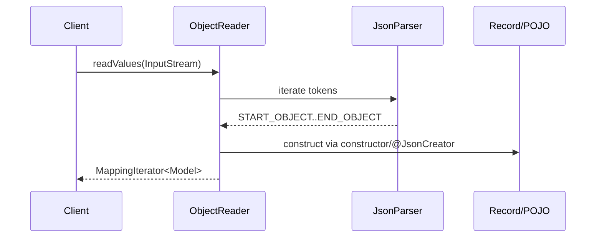
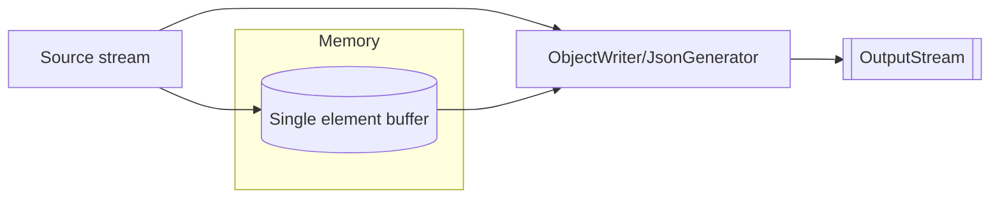

2025-10-22 20:51
Tags: #ObjectMapper #Jackson

## 58.1.1. Архитектура Jackson

Jackson состоит из трёх основных уровней:

| Уровень       | Модуль                                                        | Суть                                                                         | Когда применять                                  |
| ------------- | ------------------------------------------------------------- | ---------------------------------------------------------------------------- | ------------------------------------------------ |
| Streaming API | `jackson-core` (`JsonFactory`, `JsonParser`, `JsonGenerator`) | Низкоуровневая работа с токенами JSON (минимум аллокаций, максимум контроля) | Огромные потоки, минимальная задержка/память     |
| Tree Model    | `jackson-databind` (`JsonNode`, `ObjectMapper`)               | Древовидное представление JSON                                               | Динамические схемы, манипуляции JSON как деревом |
| Data Binding  | `jackson-databind` (`ObjectMapper`)                           | Преобразование JSON ↔ Java POJO/record                                       | 95% прикладных задач, валидация данных, DTO      |

`ObjectMapper` — «фасад» над `Tree Model` и `Data Binding`; использует `JsonFactory` из `jackson-core` внутрь.

**Формально о типах:** при data `binding Jackson` должен уметь вывести цельный тип (JLS §4 «Types», §18 «Generics») — для коллекций и карт нужен _реальный_ параметризованный тип (например, `List<Foo>`), а не сырой `List`.

## 58.1.2. Жизненный цикл и потокобезопасность

- `ObjectMapper` после конфигурации **потокобезопасен** для чтения/записи. Рекомендуется **создавать один бин** (Singleton) или пул, а не инстанцировать на каждый запрос.
    
- Настройки: модули (`registerModule`), фичи (`enable/disable`), видимость (`setVisibility`), стратегии имён, сериалайзеры/десериалайзеры.
    

## 58.1.3. Ключевые модули и опции

- **`JavaTimeModule`** — корректная поддержка `java.time` API (`Instant`, `LocalDate`, `ZonedDateTime` и т.п.).
    
- **Features** (`SerializationFeature`, `DeserializationFeature`, `MapperFeature`) — точная настройка поведения. Примеры:
    
    - `FAIL_ON_UNKNOWN_PROPERTIES` (обычно **disable** в интеграциях)
        
    - `WRITE_DATES_AS_TIMESTAMPS` (обычно **disable**, чтобы писать ISO-8601)
        
- **Видимость и аннотации**:
    
    - `@JsonProperty`, `@JsonIgnore`, `@JsonInclude`, `@JsonFormat`
        
    - `@JsonCreator` для конструкторов/фабрик; для **records** аннотации часто не нужны — параметры канонического конструктора маппятся по имени.
        

## 58.1.4. Полиморфизм и безопасность

- Полиморфный data binding (`@JsonTypeInfo`, `@JsonSubTypes`) удобен, но **опасен** при включении «default typing» на произвольных входных данных (возможны gadget-атаки). Принципы:
    
    - Не включать «всё подряд» (`activateDefaultTyping`) на внешних данных.
        
    - Ограничивать закрытой иерархией (sealed), явными подтипами, верификацией.
        

---

### ✔ Правильные примеры (3)

**(1) Базовая конфигурация с JavaTime и игнором неизвестных полей**

```java
ObjectMapper MAPPER = new ObjectMapper()
    .registerModule(new JavaTimeModule())
    .disable(DeserializationFeature.FAIL_ON_UNKNOWN_PROPERTIES)
    .disable(SerializationFeature.WRITE_DATES_AS_TIMESTAMPS);
```

**(2) Настройка видимости и включение только ненулевых значений**

```java
ObjectMapper MAPPER = new ObjectMapper()
    .setSerializationInclusion(JsonInclude.Include.NON_NULL)
    .setVisibility(PropertyAccessor.FIELD, JsonAutoDetect.Visibility.ANY);
```

**(3) Безопасный явный полиморфизм**

```java
@JsonTypeInfo(use = JsonTypeInfo.Id.NAME, include = JsonTypeInfo.As.PROPERTY, property = "kind")
@JsonSubTypes({
  @JsonSubTypes.Type(value = Dog.class, name = "dog"),
  @JsonSubTypes.Type(value = Cat.class, name = "cat")
})
sealed interface Pet permits Dog, Cat {}
record Dog(String name) implements Pet {}
record Cat(String name) implements Pet {}
```

### ✖ Ошибочные примеры (2)

**(E1) Создание `ObjectMapper` на каждый вызов (производительность)**

```java
// Антипаттерн: тяжёлое создание + потеря кэшей сериализаторов
String json = new ObjectMapper().writeValueAsString(obj);
```

_Проблема:_ лишние аллокации, потеря бенефитов кеширования.

**(E2) Небезопасный «default typing» на внешних данных**

```java
ObjectMapper M = new ObjectMapper();
M.activateDefaultTyping(M.getPolymorphicTypeValidator(), ObjectMapper.DefaultTyping.EVERYTHING);
// Потенциально опасно для недоверенных JSON
```

_Проблема:_ риск gadget-инъекций. Используйте явный полиморфизм и проверяйте типы.

**Типичные ошибки и подводные камни**

- Игнор `JavaTimeModule` → даты как числа эпохи или ошибки парсинга.
    
- Случайное включение `WRITE_DATES_AS_TIMESTAMPS` → несовместимые форматы.
    
- Несогласованная стратегия имён (snake_case ↔ camelCase) между сервисами.
    
- Полиморфизм «по умолчанию» без белых списков типов — **нельзя** на внешних данных.
    

## 58.1.5. Streaming API (JsonParser / JsonGenerator)

**Назначение.** Низкоуровневый контроль чтения/записи JSON-токенов без материализации дерева в память. Минимальные аллокации; подходит для больших потоков.

### Пошаговое чтение токенов (JsonParser)

```java
var factory = JsonFactory.builder().build();
try (var in = Files.newInputStream(Path.of("input.json"));
     var parser = factory.createParser(in)) {

    while (parser.nextToken() != null) {
        JsonToken t = parser.currentToken();
        switch (t) {
            case FIELD_NAME -> {
                String name = parser.currentName();
                // Можно принять решение: пропустить поле/прочитать значение
            }
            case VALUE_STRING -> {
                String s = parser.getText(); // не материализуем ничего лишнего
                // обработка строки
            }
            case VALUE_NUMBER_INT -> {
                long v = parser.getLongValue();
            }
            case START_OBJECT, END_OBJECT, START_ARRAY, END_ARRAY -> {
                // контроль структуры/глубины
            }
            default -> { /* игнорируем несущ. для нас типы */ }
        }
    }
}
```

### Генерация большого массива без материализации (JsonGenerator)

```java
var factory = JsonFactory.builder().build();
try (var out = Files.newBufferedWriter(Path.of("dump.json"), StandardCharsets.UTF_8);
     var gen = factory.createGenerator(out)) {
    gen.writeStartArray();                 // [
    for (Record e : streamRecords()) {     // любая лениво итерируемая коллекция
        gen.writeStartObject();            // {
        gen.writeStringField("id", e.id());
        gen.writeNumberField("value", e.value());
        gen.writeEndObject();              // }
    }
    gen.writeEndArray();                   // ]
    gen.flush();                           // гарантируем запись
}
```

### Трансформация «на лету»: копируем только нужные поля

```java
var inFactory  = JsonFactory.builder().build();
var outFactory = JsonFactory.builder().build();
try (var in = Files.newInputStream(Path.of("big.json"));
     var out = Files.newBufferedWriter(Path.of("filtered.json"), StandardCharsets.UTF_8);
     var p = inFactory.createParser(in);
     var g = outFactory.createGenerator(out)) {

    if (p.nextToken() != JsonToken.START_ARRAY) throw new IllegalStateException("expect array");
    g.writeStartArray();
    while (p.nextToken() == JsonToken.START_OBJECT) {
        g.writeStartObject();
        while (p.nextToken() != JsonToken.END_OBJECT) {
            if (p.currentToken() == JsonToken.FIELD_NAME) {
                String name = p.getCurrentName();
                p.nextToken(); // перейти к значению
                if (name.equals("id") || name.equals("createdAt")) {
                    g.writeFieldName(name);
                    g.copyCurrentEvent(p); // не читаем в String/Instant — просто копируем токен
                } else {
                    p.skipChildren(); // пропускаем ненужные вложенные структуры
                }
            }
        }
        g.writeEndObject();
    }
    g.writeEndArray();
}
```

#### ✔ Корректные примеры (ещё 3)

1. **Ограничение глубины чтения (DoS-защита):**
    

```java
var factory = JsonFactory.builder()
    .streamReadConstraints(StreamReadConstraints.builder().maxDepth(100).build())
    .build();
```

2. **Чтение чисел как BigDecimal для точности:**
    

```java
var factory = JsonFactory.builder()
    .enable(JsonReadFeature.USE_BIG_DECIMAL_FOR_FLOATS.mappedFeature())
    .build();
```

3. **Запись UTF-8 напрямую в OutputStream (без промежуточных строк):**
    

```java
try (var out = Files.newOutputStream(Path.of("out.json"));
     var gen = JsonFactory.builder().build().createGenerator(out)) {
    gen.writeStartObject();
    gen.writeStringField("status", "ok");
    gen.writeEndObject();
}
```

#### ✖ Ошибочные примеры (2)

- **E1. Не закрыт генератор → повреждён JSON (нет закрывающей скобки):**
    

```java
var gen = new JsonFactory().createGenerator(System.out);
gen.writeStartArray();
gen.writeString("x");
// забыли gen.writeEndArray(); и close()
```

- **E2. Игнор типов токенов и чтение «не того» значения (runtime):**
    

```java
if (parser.nextToken() == JsonToken.VALUE_NUMBER_INT) {
    String s = parser.getText(); // допустимо, но логически ошибка: ожидается число
    // позднее ClassCast/логические баги
}
```

**Подводные камни (Streaming):**

- Всегда закрывайте `JsonGenerator`/`JsonParser` (try-with-resources).
    
- Не полагайтесь на `getText()` для чисел, если важна точность/диапазон.
    
- Включайте ограничения `StreamReadConstraints` для защиты от глубокой вложенности/длинных чисел.
    

---

## 58.1.6. Tree Model (JsonNode) — модификация и сериализация

**Назначение.** Работа с JSON как с изменяемым деревом (`ObjectNode`, `ArrayNode`), когда схема динамическая или нужна правка на лету.

### Изменение узла и сериализация обратно

```java
ObjectMapper mapper = new ObjectMapper();
ObjectNode root = (ObjectNode) mapper.readTree("""
  {"user":{"id":"u1","name":"Ann","roles":["USER","ADMIN"]},"meta":{"v":1}}
""");

// Меняем имя
((ObjectNode) root.path("user")).put("name", "Anna");

// Удаляем роль ADMIN
ArrayNode roles = (ArrayNode) root.at("/user/roles");
for (int i = 0; i < roles.size(); i++) {
    if (roles.get(i).asText().equals("ADMIN")) { roles.remove(i); break; }
}

// Добавляем поле
root.with("meta").put("updated", true);

String out = mapper.writerWithDefaultPrettyPrinter().writeValueAsString(root);
```

### Удаление узла по JSON Pointer и добавление значения по пути

```java
ObjectNode root = (ObjectNode) mapper.readTree(json);
JsonPointer ptr = JsonPointer.compile("/user/obsolete");
JsonNode parent = root.at("/user");
if (parent.isObject()) {
    ((ObjectNode) parent).remove("obsolete");
}
root.with("user").put("active", true);
```

### Объединение деревьев (merge) с приоритетом правого

```java
ObjectNode base = (ObjectNode) mapper.readTree("""{"a":1,"b":{"x":10}}""");
ObjectNode patch = (ObjectNode) mapper.readTree("""{"b":{"y":20},"c":3}""");
base.set("b", base.with("b").setAll((ObjectNode) patch.get("b")));
patch.fields().forEachRemaining(e -> { if (!e.getKey().equals("b")) base.set(e.getKey(), e.getValue()); });
String merged = mapper.writeValueAsString(base);
```

#### ✔ Корректные примеры (ещё 3)

1. **Чтение подмассива и маппинг его в тип:**
    

```java
JsonNode arr = mapper.readTree(json).at("/payload/items");
List<Item> items = mapper.readerFor(new TypeReference<List<Item>>(){}).readValue(arr);
```

2. **Замена элемента массива по индексу:**
    

```java
ArrayNode a = (ArrayNode) mapper.readTree("[1,2,3]");
a.set(1, IntNode.valueOf(42)); // [1,42,3]
```

3. **Удаление всех узлов по имени (одноуровнево):**
    

```java
ObjectNode o = (ObjectNode) mapper.readTree(json);
Iterator<String> it = o.fieldNames();
List<String> toRemove = new ArrayList<>();
it.forEachRemaining(f -> { if (f.startsWith("_")) toRemove.add(f); });
toRemove.forEach(o::remove);
```

#### ✖ Ошибочные примеры (2)

- **E1. Неправильный каст массива к ObjectNode (ClassCastException):**
    

```java
ObjectNode o = (ObjectNode) mapper.readTree("[1,2]"); // runtime: нельзя
```

- **E2. Ожидание, что `path()` вернёт null (он возвращает MissingNode):**
    

```java
JsonNode n = root.path("absent");
if (n == null) { /* никогда не выполнится */ }
n.get("x").asText(); // NPE/логическая ошибка, нужно проверять isMissingNode()
```

**Подводные камни (Tree):**

- Отличайте `path()` (возвращает `MissingNode`) от `get()` (может вернуть `null`).
    
- `ObjectNode`/`ArrayNode` мутируемы, `TextNode`/`IntNode` — нет.
    
- Следите за производительностью: дерево = дополнительные аллокации; для больших потоков лучше Streaming.
    

---

## 58.1.7. ObjectReader / ObjectWriter (замороженные конфигурации)

**Определение.** `ObjectReader`/`ObjectWriter` — потокобезопасные, переиспользуемые объекты, «зафиксированные» для конкретного типа/настроек. Уменьшают стоимость повторной конфигурации и улучшают читаемость.

```java
ObjectMapper mapper = new ObjectMapper().registerModule(new JavaTimeModule());
ObjectReader reader = mapper.readerFor(new TypeReference<List<User>>() {});
ObjectWriter writer = mapper.writerWithDefaultPrettyPrinter();

try (var in = Files.newBufferedReader(Path.of("users.json"))) {
    List<User> users = reader.readValue(in); // без лишних TypeFactory вызовов
}

String json = writer.writeValueAsString(new User("u1", "Ann", Instant.now()));
```

**Подводные камни (Reader/Writer):**

- Меняя конфигурацию `ObjectMapper` **после** получения `ObjectReader/ObjectWriter`, вы **не** измените уже созданные ридеры/райтеры.
    
- Держите их как final-синглтоны/бины, если используете часто.
    

---

## 58.1.8. Afterburner и ParameterNamesModule

- **Afterburner** (`jackson-module-afterburner`) генерирует байткод для ускорения доступа к полям/методам.  
    **Уместно:** высоконагруженные сервисы, горячие DTO.  
    **Неуместно/осторожно:** GraalVM native-image, необычные ClassLoader’ы, строгая политика безопасности.
    

```java
ObjectMapper mapper = new ObjectMapper()
    .registerModule(new JavaTimeModule())
    .registerModule(new AfterburnerModule());
```

- **ParameterNamesModule** позволяет использовать имена параметров конструктора без аннотаций (требует `-parameters` при компиляции).
    

```java
ObjectMapper mapper = new ObjectMapper()
    .registerModule(new ParameterNamesModule())
    .registerModule(new JavaTimeModule());
```

**Подводные камни:**

- Afterburner может конфликтовать с инструментами байткода/секьюрити-менеджером.
    
- Без флага `-parameters` `ParameterNamesModule` не увидит имена.
    

---

## 58.1.9. JPMS (модули): module-info и «opens» для Jackson

**Мини-пример `module-info.java`:**

```java
module com.example.app {
    requires com.fasterxml.jackson.core;
    requires com.fasterxml.jackson.databind;
    requires com.fasterxml.jackson.annotation;
    requires com.fasterxml.jackson.datatype.jsr310;

    // если используете рефлексию к полям/конструкторам в вашем пакете моделей
    opens com.example.model to com.fasterxml.jackson.databind;

    // остальной код можно только exports, если нужно
    exports com.example.api;
}
```

**Замечания:**

- У Jackson-банок есть `Automatic-Module-Name` → стабильные имена модулей (`com.fasterxml.jackson.databind` и др.).
    
- Частая ошибка: забыть `opens` для пакета моделей — Jackson не сможет рефлексировать приватные поля/конструкторы (особенно при `setVisibility(FIELD, ANY)`).
    

---

## 58.1.10. Таблица соответствия JSON ↔ Java типов (ссылка на JLS)

|JSON|Java тип по умолчанию|Примечания (JLS)|
|---|---|---|
|object|POJO/record/`Map<String,?>`|JLS §8 (классы), §12 (records). Поля/конструкторы/аннотации.|
|array|`List<T>` / массив `T[]`|JLS §10 (arrays), §18 (generics). Нужен параметризованный тип.|
|string|`String`, также `Enum`, `UUID`, `java.time`|JLS §4.3.1. Строки; для Enum — маппинг по имени; для `java.time` — `JavaTimeModule`.|
|number|`int/long/double` или `BigDecimal/BigInteger`|JLS §5 (numeric conversions). Для точности — `USE_BIG_DECIMAL_FOR_FLOATS`.|
|boolean|`boolean/Boolean`|Boxing/unboxing (JLS §5.1.7).|
|null|`null` → референс-типы|Автобоксинг/анбоксинг может дать `NullPointerException`.|

**Где вступают JLS §4, §5, §18:**

- §4 — корректность типов целевого поля/параметра конструктора.
    
- §5 — контексты преобразований (numeric promotions, boxing/unboxing) при вызове сеттеров/конструкторов.
    
- §18 — вывод типовых аргументов при дженериках: обязателен конкретный `T`.
    

---

## 58.1.11. Безопасность

**Небезопасные опции (избегать на внешних данных):**

- `activateDefaultTyping(...)` / «base polymorphic deserialization» без белого списка.
    
- Разрешения: `JsonReadFeature.ALLOW_UNQUOTED_FIELD_NAMES`, `ALLOW_SINGLE_QUOTES` — делают парсер более «попустительным».
    
- Полиморфизм без явных `@JsonSubTypes`.
    

**Ограничения для защиты от DoS:**

```java
var factory = JsonFactory.builder()
    .streamReadConstraints(StreamReadConstraints.builder()
        .maxDepth(100)
        .maxNumberLength(1000)
        .maxNameLength(1000)
        .build())
    .build();
```

---

## 58.1.12. Аннотации Jackson — сводная таблица

|Аннотация|Назначение|Конфликты/заметки|
|---|---|---|
|`@JsonProperty`|Явное имя свойства/параметра|Перекрывает стратегию имён|
|`@JsonIgnore`|Исключить поле/геттер|Конфликтует с `@JsonProperty`|
|`@JsonInclude`|Политика включения (NON_NULL и т.д.)|Глобальная политика может быть переопределена на поле|
|`@JsonCreator`|Конструктор/фабрика для создания|Требует `@JsonProperty` на параметрах, если имена не выведены|
|`@JsonValue`|Единственное «значение» типа при сериализации|Конфликтует с полями/геттерами по умолчанию|
|`@JsonAnySetter`|Собрать «лишние» пары имя→значение|Влияет на схему; использовать осознанно|
|`@JsonAnyGetter`|Выгрузить «доп. пары» в JSON|Сочетается с `Map<String,Object>`|
|`@JsonIdentityInfo`|Сохранение идентичности/ссылок|Осторожно с внешними контрактами|
|`@JsonView`|Проекции (разные представления)|Требует `ObjectWriter.withView()`|
|`@JsonFilter`|Runtime-фильтрация полей|Нужен `FilterProvider` на writer|


## 58.1.13. Зависимости и согласование версий (Maven/Gradle, «одна семья»)

**Определение.** _Согласование версий_ — требование использовать артефакты Jackson одной мажорной/минорной линии (`jackson-core`, `jackson-databind`, `jackson-annotations`, дополнительные модули), чтобы избежать несовместимости бинарных контрактов (JLS §13 — binary compatibility; применимо к библиотекам, на которые компилируется/линкуется код).

### Рекомендуемый состав зависимостей

- Базово:
    
    - `com.fasterxml.jackson.core:jackson-core`
        
    - `com.fasterxml.jackson.core:jackson-databind`
        
    - `com.fasterxml.jackson.core:jackson-annotations`
        
- Для времени/дат:
    
    - `com.fasterxml.jackson.datatype:jackson-datatype-jsr310`
        
- Опционально:
    
    - `com.fasterxml.jackson.module:jackson-module-parameter-names`
        
    - `com.fasterxml.jackson.module:jackson-module-afterburner`
        

#### Maven (с «родителем» для выравнивания версий)

```xml
<dependencyManagement>
  <dependencies>
    <dependency>
      <groupId>com.fasterxml.jackson</groupId>
      <artifactId>jackson-bom</artifactId>
      <version>2.17.2</version><!-- пример -->
      <type>pom</type>
      <scope>import</scope>
    </dependency>
  </dependencies>
</dependencyManagement>

<dependencies>
  <dependency>
    <groupId>com.fasterxml.jackson.core</groupId>
    <artifactId>jackson-databind</artifactId>
  </dependency>
  <dependency>
    <groupId>com.fasterxml.jackson.core</groupId>
    <artifactId>jackson-core</artifactId>
  </dependency>
  <dependency>
    <groupId>com.fasterxml.jackson.core</groupId>
    <artifactId>jackson-annotations</artifactId>
  </dependency>
  <dependency>
    <groupId>com.fasterxml.jackson.datatype</groupId>
    <artifactId>jackson-datatype-jsr310</artifactId>
  </dependency>
</dependencies>
```

#### Gradle (Kotlin DSL) с BOM

```kotlin
dependencies {
  implementation(platform("com.fasterxml.jackson:jackson-bom:2.17.2"))
  implementation("com.fasterxml.jackson.core:jackson-databind")
  implementation("com.fasterxml.jackson.core:jackson-core")
  implementation("com.fasterxml.jackson.core:jackson-annotations")
  implementation("com.fasterxml.jackson.datatype:jackson-datatype-jsr310")
}
```

#### ✔ Корректные примеры (3)

1. **Использование BOM** для единых версий (см. выше).
    
2. **Добавление `jackson-datatype-jsr310`** вместе с `registerModule(new JavaTimeModule())`.
    
3. **ParameterNamesModule** + компиляция с `-parameters` (см. 58.1.8).
    

#### ✖ Ошибочные примеры (2)

- **E1. «Ромашка» версий** — разные минорные версии у `databind` и `core`:
    
    ```xml
    <dependency>jackson-databind:2.17.2</dependency>
    <dependency>jackson-core:2.13.5</dependency> <!-- несовместимо -->
    ```
    
    _Риск:_ `NoSuchMethodError`, `LinkageError` на рантайме.
    
- **E2. Отсутствие `jackson-annotations` при использовании аннотаций**  
    _Результат:_ ошибки маппинга/игнорирование аннотаций.
    

**Подводные камни**

- Тени от других BOM/платформ → проверяйте эффективное дерево зависимостей.
    
- Afterburner требует совместимой версии с вашим `databind`.
    
- В мульти-модульных проектах используйте единый BOM на корневом уровне.
    

---

## 58.1.14. Кодировки и I/O (Oracle API): Charset, потоки, backpressure

**Определение.** _Кодировка_ — отображение символов Юникода в байтовую последовательность. Для JSON следует применять **UTF-8** (RFC 8259). В JDK — `java.nio.charset.Charset`, `StandardCharsets.UTF_8`.

### Практика чтения/записи

- Явно указывать **`UTF-8`** при работе с `Reader/Writer`/`Files`.
    
- Для больших объёмов избегать промежуточных `String`: работать с `InputStream`/`OutputStream` или `Reader/Writer` напрямую.
    

#### ✔ Корректные примеры (3)

1. **Чтение файла UTF-8**:
    

```java
try (var reader = Files.newBufferedReader(Path.of("data.json"), StandardCharsets.UTF_8)) {
  JsonNode root = new ObjectMapper().readTree(reader);
}
```

2. **Запись без промежуточных строк**:
    

```java
try (var out = Files.newOutputStream(Path.of("out.json"))) {
  new ObjectMapper().writeValue(out, dto);
}
```

3. **Буферизация на больших потоках**:
    

```java
try (var in = new BufferedInputStream(Files.newInputStream(path))) {
  MappingIterator<Item> it = mapper.readerFor(Item.class).readValues(in);
  while (it.hasNext()) process(it.next());
}
```

#### ✖ Ошибочные примеры (2)

- **E1. Системная кодировка по умолчанию**:
    
    ```java
    new FileReader("data.json"); // использует default charset → баги на non-UTF-8 системах
    ```
    
- **E2. Чтение огромного файла через `Files.readString`** → пик памяти.
    

**Подводные камни**

- Непредсказуемая platform default charset. Всегда задавайте `UTF-8`.
    
- Не грузите гигантские JSON в строку — используйте потоковые API Jackson (см. 58.1.5).
    

---

## 58.1.15. Исключения Jackson: таксономия и обработка

**Определение.** Во время парсинга/байндинга Jackson генерирует специализированные исключения. Их корректная обработка упрощает диагностику.

|Исключение|Когда возникает|Типичные причины|
|---|---|---|
|`JsonParseException`|Синтаксическая ошибка JSON|Неполный/битый ввод, лишние/некорректные токены|
|`JsonMappingException`|Ошибка сопоставления JSON ↔ Java|Несоответствие типов, отсутствие конструктора|
|`MismatchedInputException`|Частный случай mapping|Ожидали массив, получили объект и т.п.|
|`InvalidDefinitionException`|Конфигурационная ошибка|Нет подходящей фабрики, конфликт аннотаций|
|`StreamConstraintsException`|Нарушены ограничения чтения|Превышение глубины/длины токена|

#### ✔ Корректные примеры (3)

1. **Диагностика с путём поля**:
    

```java
try {
  mapper.readValue(json, Dto.class);
} catch (JsonMappingException e) {
  log.error("Mapping error at {}: {}", e.getPathReference(), e.getOriginalMessage());
}
```

2. **Разделение парсинга и маппинга**:
    

```java
try {
  JsonNode n = mapper.readTree(json); // parse
  Dto dto = mapper.treeToValue(n, Dto.class); // map
} catch (JsonParseException e) {
  // Синтаксис
} catch (JsonMappingException e) {
  // Типы/схема
}
```

3. **Ограничения и обработка**:
    

```java
var factory = JsonFactory.builder()
  .streamReadConstraints(StreamReadConstraints.builder().maxDepth(64).build())
  .build();
try (var p = factory.createParser(json)) { /* ... */ }
catch (StreamConstraintsException e) { /* 413 Payload Too Large, например */ }
```

#### ✖ Ошибочные примеры (2)

- **E1. Глотание всех исключений** и возврат пустого объекта → тихая порча данных.
    
- **E2. Логирование `e.getMessage()` без `getPathReference()`** → трудно диагностировать поле.
    

**Подводные камни**

- Отделяйте ошибки ввода (400 Bad Request) и внутренние (500).
    
- Валидация схемы до маппинга может упростить диагностику.
    

---

## 58.1.16. Тестирование: JSON-ассёрты, golden-files, snapshot-подход

**Определение.** _Golden file/snapshot_ — эталонный JSON, с которым сравнивается вывод/ввод; помогает держать контракт стабильным.

#### ✔ Корректные примеры (3)

1. **Проверка «деревом», не строкой**:
    

```java
JsonNode expected = mapper.readTree(Files.readString(Path.of("golden.json")));
JsonNode actual = mapper.readTree(mapper.writeValueAsString(dto));
assertEquals(expected, actual); // сравнение структур, а не форматирования
```

2. **JSONAssert (lenient)**:
    

```java
JSONAssert.assertEquals("{\"a\":1,\"b\":[1,2]}", actualJson, false);
```

3. **Контроль backward-совместимости**:  
    при добавлении поля ожидаем, что старый потребитель не упадёт → тест с `FAIL_ON_UNKNOWN_PROPERTIES=false`.
    

#### ✖ Ошибочные примеры (2)

- **E1. Сравнение строк JSON** (зависит от пробелов/порядка полей).
    
- **E2. Необновлённые golden-файлы без обзора изменений** → ложная стабильность.
    

**Подводные камни**

- Стабилизируйте формат (ISO-8601, порядок, включение/исключение null), чтобы тесты не «флипали».
    
- Для больших JSON используйте «дерево» и выборочные JSONPath-ассёрты.
    

---

## 58.1.17. Gson — мини-пример и особенности

**Определение.** Gson — библиотека data binding/деревьев (`JsonElement`) для JSON, проще Jackson, но обычно медленнее; слабее поддержка `java.time`.

#### ✔ Корректные примеры (3)

1. **Базовая сериализация/десериализация**:
    

```java
Gson gson = new GsonBuilder().serializeNulls().create();
String json = gson.toJson(dto);
Dto back = gson.fromJson(json, Dto.class);
```

2. **Адаптер для `Instant`**:
    

```java
Gson gson = new GsonBuilder()
  .registerTypeAdapter(Instant.class, (JsonDeserializer<Instant>)
      (el, t, ctx) -> Instant.parse(el.getAsString()))
  .registerTypeAdapter(Instant.class, (JsonSerializer<Instant>)
      (v, t, ctx) -> new JsonPrimitive(v.toString()))
  .create();
```

3. **Деревянная модель**:
    

```java
JsonObject obj = JsonParser.parseString(json).getAsJsonObject();
obj.addProperty("active", true);
```

#### ✖ Ошибочные примеры (2)

- **E1. Ожидание, что Gson «знает» `java.time` по умолчанию** → `UnsupportedOperationException`.
    
- **E2. Полагаться на внутренний порядок полей при сравнении строк JSON.**
    

**Подводные камни**

- Меньше аннотаций/модулей по сравнению с Jackson.
    
- Будьте явны с датами/числами.
    

---

## 58.1.18. Jakarta JSON: JSON-B и JSON-P — мини-примеры

**Определения.**

- **JSON-P (JSR 374/353)** — стандарт Jakarta для потокового и объектного API (аналог Streaming/Tree).
    
- **JSON-B (JSR 367)** — стандартный data binding поверх JSON-P.
    

#### ✔ Корректные примеры (3)

1. **JSON-P: потоковое чтение**:
    

```java
try (JsonParser p = Json.createParser(Files.newBufferedReader(path))) {
  while (p.hasNext()) {
    JsonParser.Event e = p.next();
    if (e == JsonParser.Event.KEY_NAME) { /* ... */ }
  }
}
```

2. **JSON-P: построение объекта**:
    

```java
JsonObject obj = Json.createObjectBuilder()
  .add("id", "u1")
  .add("active", true)
  .build();
```

3. **JSON-B: биндинг**:
    

```java
Jsonb jsonb = JsonbBuilder.create();
String json = jsonb.toJson(dto);
Dto back = jsonb.fromJson(json, Dto.class);
```

#### ✖ Ошибочные примеры (2)

- **E1. Ожидать автоматической поддержки `java.time` форматов без аннотаций** — используйте `@JsonbDateFormat`.
    
- **E2. Смешивать провайдеры JSON-P от разных имплементаций в одном класспасе** → конфликты.
    

**Подводные камни**

- Производительность и экосистема могут уступать Jackson.
    
- Хороший выбор для Jakarta EE, где важна «стандартность» контейнера.
    

---

## 58.1.19. Схемы и валидация (JSON Schema)

**Определение.** _JSON Schema_ — декларативное описание структуры JSON (типы, обязательность, форматы), используемое для валидации входных данных **до** data binding.

**Практика использования**

- Для внешних/недоверенных данных валидируйте JSON Schema до биндинга Jackson, чтобы:
    
    1. отделить синтаксис/схему от маппинга;
        
    2. выдавать человекопонятные ошибки;
        
    3. защититься от несанкционированных полей/значений.
        

#### ✔ Корректные примеры (3)

1. **Сначала схема, потом биндинг** (псевдокод):
    

```java
validateWithSchema(jsonBytes, schema);
Dto dto = mapper.readValue(jsonBytes, Dto.class);
```

2. **Ограничения размера/глубины + схема** — комбинированная защита.
    
3. **Версионирование схем**: держите `v1`, `v2` бок-о-бок; данные несущ. версии пролетят по `oneOf`.
    

#### ✖ Ошибочные примеры (2)

- **E1. Полагаться только на `FAIL_ON_UNKNOWN_PROPERTIES=false`** как «валидацию».
    
- **E2. Миксовать несколько несовместимых версий схем в одном эндпойнте без диспетчеризации.**
    

**Подводные камни**

- Не перегружайте схему бизнес-правилами. Часть логики должна оставаться на уровне приложения.
    
- Следите за временем валидации на больших объектах (кешируйте компилированные схемы).
    

---

## 58.1.20. Диаграммы: десериализация и потоковая запись

### Последовательность десериализации (для Obsidian)



### Потоковая запись большого массива (O(1) RAM на элемент)




Готово. Начинаю формировать **завершающие подразделы 58.1.21–58.1.25**, строго в стиле всей главы: формальные определения + JLS/Oracle ссылки + примеры (3 корректных / 2 ошибочных) + таблицы + подводные камни.


# **58.1.21. Performance and Memory Model (Производительность и модель памяти Jackson)**

### **Формальное определение производительности в контексте ObjectMapper**

- **Производительность (latency)** — время преобразования JSON ↔ объект (микросекунды на объект).
    
- **Пропускная способность (throughput)** — количество объектов в секунду.
    
- **Модель памяти** — объём аллокаций (heap allocation), обращения к GC, использование пулов байтов.
    

Jackson основан на:

- Потоковом API (`JsonParser`, `JsonGenerator`) — минимальные аллокации.
    
- Data Binding (`ObjectMapper`) — использует рефлексию или байткод-генерацию (через Afterburner).
    
- Cache планов сериализации/десериализации — повторное использование `Serializer`, `Deserializer`, `JsonFactory`.
    

### **Основные факторы влияния**

|Механизм|Влияние на скорость|Аллокации|Примечание|
|---|---|---|---|
|Streaming API|Максимум производительности|Минимальные|Низкоуровневый контроль|
|ObjectMapper без модулей|Базовый|Средние|Рефлексия|
|ObjectMapper + Afterburner|+15–30%|Незначительное снижение|Генерация байткода|
|ObjectReader/ObjectWriter|+5–10%|Снижение GC|Предкомпиленные планы|
|Records vs POJO|+5–15%|Меньше overhead|Канонический конструктор быстрый для рефлексии|

---

### ✔ **Корректные (производительные) примеры**

**(1) Пул ObjectWriter для горячего пути**

```java
private static final ObjectWriter WRITER =
  new ObjectMapper()
    .registerModule(new JavaTimeModule())
    .writerFor(Event.class);

public byte[] serialize(Event e) throws IOException {
  return WRITER.writeValueAsBytes(e); // нулевая конфигурация на каждом вызове
}
```

**(2) Режим поточной сериализации для O(1) памяти**

```java
try (SequenceWriter sw = WRITER.writeValues(outputStream)) {
  for (Event e : eventStream()) {
    sw.write(e); // не удерживает весь JSON в памяти
  }
}
```

**(3) Использование Afterburner**

```java
ObjectMapper mapper = new ObjectMapper()
    .registerModule(new AfterburnerModule());
```

---

### ✖ **Ошибочные схемы (антипаттерны)**

**(E1) Создание ObjectMapper на каждый вызов**

```java
String json = new ObjectMapper().writeValueAsString(obj); // +200µs overhead
```

_Проблема: каждый вызов создаёт внутренние кеши и вызывает ClassLoader._

**(E2) Последовательная сериализация через String**

```java
String json = mapper.writeValueAsString(obj); 
outputStream.write(json.getBytes(StandardCharsets.UTF_8)); // двойная аллокация
```

_Правильно писать напрямую в stream._

---

### **Подводные камни (Performance Pitfalls)**

- **Пик аллокаций при сериализации больших коллекций через writeValueAsString**.
    
- **ObjectMapper без кеша типов → +150% latency при первом вызове каждого типа**.
    
- **Afterburner несовместим с GraalVM Native Image без ручной конфигурации**.
    
- **Streaming API требует ручного контроля над структурой JSON (ошибки токенов → silent data corruption).**
    

---

# **58.1.22. Framework Integration Strategies**

### **58.1.22.1 Spring Boot**

Spring Boot автоматически конфигурирует ObjectMapper как Singleton Bean (`MappingJackson2HttpMessageConverter`). Рекомендуется переопределять через `@Bean`.

```java
@Configuration
public class JacksonConfig {
  @Bean
  public ObjectMapper objectMapper() {
    return JsonMapper.builder()
      .addModule(new JavaTimeModule())
      .disable(SerializationFeature.WRITE_DATES_AS_TIMESTAMPS)
      .disable(DeserializationFeature.FAIL_ON_UNKNOWN_PROPERTIES)
      .build();
  }
}
```

👉 Все `@RestController` автоматически используют этот бин.

---

### **58.1.22.2 Micronaut / GraalVM Native**

Micronaut использует compile-time introspection → быстрее, меньше рефлексии.

```java
@Introspected
public record User(String id, Instant createdAt) {}
```

**Особенность:** Jackson должен быть включён как `jackson-databind` + `micronaut-jackson-databind`.

---

### **58.1.22.3 Quarkus**

Quarkus использует `JacksonRecorder` для AOT. Поддерживаются JSONB и Jackson. Для Jackson:

```properties
quarkus.jackson.write-dates-as-timestamps=false
quarkus.jackson.fail-on-unknown-properties=false
```

---

### ✔ **Корректные примеры интеграции**

1. Spring Boot global ObjectMapper.
    
2. Micronaut record + Jackson.
    
3. Quarkus application.properties настройка.
    

### ✖ Ошибочные примеры интеграции**

- Использовать `new ObjectMapper()` внутри контроллера → игнорирует настройки Spring Boot.
    
- Не открыть модуль для рефлексии при JPMS → `InvalidDefinitionException`.
    

---

# **58.1.23. GraalVM and Ahead-Of-Time (AOT) Considerations**

### **Особенности Jackson в native-image:**

- Рефлексия выключена по умолчанию.
    
- Нужно явно указать классы для сериализации:
    

```json
[
  {
    "name": "com.example.model.User",
    "allDeclaredConstructors": true,
    "allDeclaredFields": true
  }
]
```

### **Рекомендуется альтернативный движок: Micronaut Serde или Jackson Native (в разработке).**

---

### ✔ Корректный пример**

```bash
native-image \
  --initialize-at-build-time \
  -H:ReflectionConfigurationFiles=reflect-config.json
```

### ✖ Ошибочный пример**

```java
record User(String id, Instant createdAt) {} // Без регистрации → runtime error
```

**Подводные камни**

- Afterburner непригоден для native-image.
    
- ObjectMapper auto-discovery модулей не работает без `--initialize-at-run-time`.
    

---

# **58.1.24. Best Practices Summary (табличное резюме)**

|Сценарий|Рекомендуется|Не рекомендуется|
|---|---|---|
|Обработка больших потоков|Streaming API / SequenceWriter|`writeValueAsString(hugeList)`|
|Работа с датами|`JavaTimeModule`, ISO-8601|Epoch timestamps по умолчанию|
|Производительность|Singleton ObjectMapper + Afterburner|Создавать ObjectMapper внутри метода|
|Безопасность|Явные `@JsonTypeInfo` + ограничения|`activateDefaultTyping` для внешних данных|
|Поддержка модулей|Использовать BOM|Миксовать версии вручную|
|Интеграция|ObjectMapper как bean|`new ObjectMapper()` локально|

---

# 58.1.25. Formal References and Terminology Index

|Термин|Определение|Нормативный источник|
|---|---|---|
|_Functional interface_|Интерфейс с единственным абстрактным методом|JLS §9.8|
|_Target typing_|Вывод типа лямбды из контекста|JLS §15.12|
|_JSON serialization_|Преобразование объекта в JSON|Jackson Docs: `SerializationFeature`|
|_JSON deserialization_|Преобразование JSON в объект|JLS §4, §5 (type conversions)|
|_ObjectMapper_|Центральный класс для data binding|Jackson Databind Spec|
|_Jackson Module_|Расширение ObjectMapper для поддержки типов|Jackson Module System|
|_Default Typing_|Генерация @class для всех типов|Jackson Security Notes|
|_AOT Reflection Config_|Описание классов для GraalVM|GraalVM Native Image Guide|

отлично — добавляю полноценные **58.1.26–58.1.35** в том же стиле. Я ничего в предыдущих пунктах не меняю.

---

## 58.1.26. Кастомные сериалайзеры/десериалайзеры и `SimpleModule`

**Определение.** Кастомные сериалайзеры (`JsonSerializer<T>`) и десериалайзеры (`JsonDeserializer<T>`) — расширения механизма data binding, позволяющие задать собственный формат JSON для конкретного Java-типа. Регистрируются через `Module` (обычно `SimpleModule`) в `ObjectMapper`. Поведение учитывается кэшем сериализаторов/десериализаторов.

### 58.1.26.1. Жизненный цикл и регистрация

- Сериалайзер/десериалайзер выбирается на этапе построения плана сериализации/десериализации типа и **кешируется**.
    
- Регистрация через:
    
    ```java
    SimpleModule m = new SimpleModule()
        .addSerializer(Money.class, new MoneySer())
        .addDeserializer(Money.class, new MoneyDeser());
    mapper.registerModule(m);
    ```
    

### 58.1.26.2. Пример: тип `Money(amount: BigDecimal, currency: String)`

**Сериалайзер: объектная форма**

```java
public record Money(BigDecimal amount, String currency) {}

public final class MoneySer extends JsonSerializer<Money> {
  @Override public void serialize(Money v, JsonGenerator g, SerializerProvider p) throws IOException {
    g.writeStartObject();
    g.writeStringField("amount", v.amount().toPlainString()); // без потери точности
    g.writeStringField("currency", v.currency());
    g.writeEndObject();
  }
}
```

**Десериалайзер: «число или строка» → BigDecimal**

```java
public final class MoneyDeser extends JsonDeserializer<Money> {
  @Override public Money deserialize(JsonParser p, DeserializationContext ctx) throws IOException {
    JsonNode n = p.readValueAsTree();
    String amount = n.get("amount").isNumber() ? n.get("amount").asText()
                                               : n.get("amount").textValue();
    return new Money(new BigDecimal(amount), n.get("currency").asText());
  }
}
```

#### ✔ Корректные примеры (3)

1. **Регистрация через `SimpleModule` + `JavaTimeModule` совместно**
    

```java
ObjectMapper mapper = JsonMapper.builder()
    .addModule(new JavaTimeModule())
    .addModule(new SimpleModule().addSerializer(Money.class, new MoneySer()))
    .build();
```

2. **Кастомный key-serializer для `Map<Instant, T>`**
    

```java
SimpleModule mod = new SimpleModule();
mod.addKeySerializer(Instant.class, new JsonSerializer<Instant>() {
  @Override public void serialize(Instant v, JsonGenerator g, SerializerProvider sp) throws IOException {
    g.writeFieldName(v.toString()); // ISO-8601 ключ
  }
});
```

3. **Кастомный десериалайзер, учитывающий пустые строки**
    

```java
mod.addDeserializer(UUID.class, new JsonDeserializer<UUID>() {
  @Override public UUID deserialize(JsonParser p, DeserializationContext c) throws IOException {
    String s = p.getValueAsString();
    return (s == null || s.isBlank()) ? null : UUID.fromString(s);
  }
});
```

#### ✖ Ошибочные примеры (2)

- **E1. Двойной `writeStartObject()` в сериалайзере** — сломает структуру JSON.
    
- **E2. Десериалайзер, читающий напрямую из `p.getText()` в случае объекта** — потеря структуры; используйте `readValueAsTree()` или по токенам.
    

**Подводные камни**

- Сериалайзеры/десериалайзеры **кешируются** — изменять их состояние после регистрации нельзя.
    
- Учитывайте null-политику (`isEmpty`, `@JsonInclude`) — кастомные сериалайзеры могут влиять на включение/исключение полей.
    

---

## 58.1.27. Coercion/Leniency Matrix (строгость преобразований)

**Определение.** _Coercion_ — политика преобразования входных JSON-значений к требуемому Java-типу (строка→число, пустая строка→null и т.д.). Управляется `CoercionConfig`, `DeserializationFeature` и `JsonReadFeature`.

### 58.1.27.1. Частые политики

|Источник → Цель|По умолчанию (часто)|Рекомендация для критичных контрактов|
|---|---|---|
|`string` → `int/long`|допускается в ряде версий|**Fail:** `CoercionAction.Fail`|
|`""` (пустая строка) → объект|иногда как `null`|**Fail** или **AsNull** осознанно|
|одиночное значение → массив|`ACCEPT_SINGLE_VALUE_AS_ARRAY` выключен|включать только адресно|
|`float` → `int`|допускается|выключить `ACCEPT_FLOAT_AS_INT`|

**API-настройки**

```java
mapper.enable(DeserializationFeature.ACCEPT_SINGLE_VALUE_AS_ARRAY);
mapper.disable(DeserializationFeature.ACCEPT_FLOAT_AS_INT);

mapper.coercionConfigFor(LogicalType.Integer)
      .setCoercion(CoercionInputShape.Float, CoercionAction.Fail);

mapper.coercionConfigFor(LogicalType.POJO)
      .setCoercion(CoercionInputShape.EmptyString, CoercionAction.AsNull);
```

#### ✔ Корректные примеры (3)

1. **Запрет float→int**
    

```java
mapper.disable(DeserializationFeature.ACCEPT_FLOAT_AS_INT);
```

2. **Разрешить одиночное значение как массив только локально**
    

```java
ObjectReader r = mapper.readerFor(new TypeReference<List<String>>() {})
                       .with(DeserializationFeature.ACCEPT_SINGLE_VALUE_AS_ARRAY);
```

3. **Пустая строка как null для value-объектов**
    

```java
mapper.coercionConfigFor(LogicalType.POJO)
      .setCoercion(CoercionInputShape.EmptyString, CoercionAction.AsNull);
```

#### ✖ Ошибочные примеры (2)

- **E1. Глобально включить `ACCEPT_SINGLE_VALUE_AS_ARRAY`** → неожиданные массивы везде.
    
- **E2. Оставить `ACCEPT_FLOAT_AS_INT` включённым для денежных/идентификаторных полей** → потеря точности/смысловая ошибка.
    

**Подводные камни**

- Политики зависят от версии Jackson — фиксируйте их явно на маппере/ридере.
    
- Разные ридеры могут иметь **разные** политики; документируйте это в коде.
    

---

## 58.1.28. Enum-handling: имя, `@JsonValue`, `@JsonCreator`, fallback

**Определение.** Для `enum` по умолчанию сериализация/десериализация идёт по `name()`. Изменение стратегии — `@JsonValue` (на запись) и `@JsonCreator` (на чтение).

### Практики

- Для эволюции контрактов используйте **case-insensitive** маппинг и fallback.
    
- Никогда не меняйте `name()` существующих значений без миграции потребителей.
    

**Примеры**

```java
enum Status {
  OK, FAIL, OTHER;

  @JsonCreator
  public static Status from(String s) {
    return Arrays.stream(values())
        .filter(v -> v.name().equalsIgnoreCase(s))
        .findFirst().orElse(OTHER);
  }
}
```

```java
enum Role {
  USER("user"), ADMIN("admin");
  private final String wire;
  Role(String wire) { this.wire = wire; }
  @JsonValue public String wire() { return wire; }
}
```

#### ✔ Корректные примеры (3)

1. **Case-insensitive чтение**
    

```java
mapper.enable(MapperFeature.ACCEPT_CASE_INSENSITIVE_ENUMS);
```

2. **`@JsonValue` для стабильных строк**
    

```java
// см. Role выше
```

3. **Fallback-поле OTHER через `@JsonCreator`** — см. `Status.from(...)`.
    

#### ✖ Ошибочные примеры (2)

- **E1. Переименование элемента enum** без миграции → поломка чтения старых данных.
    
- **E2. `@JsonValue` и одновременно ожидание чтения по name()** — поведение будет разным на чтение/запись.
    

**Подводные камни**

- `@JsonValue` меняет **только сериализацию**; для чтения нужен `@JsonCreator`.
    
- Документируйте строковые значения enum как **часть публичного контракта**.
    

---

## 58.1.29. Детерминированный вывод: порядок полей, стабильность снапшотов

**Определение.** Детерминированный вывод — одинаковая сериализация для одинакового графа объектов вне зависимости от порядка итераций/HashMap.

### Настройки

```java
mapper.configure(MapperFeature.SORT_PROPERTIES_ALPHABETICALLY, true);
```

```java
@JsonPropertyOrder({"id", "createdAt", "name"})
class User { /* ... */ }
```

**Map-поля:** используйте `LinkedHashMap`/`TreeMap` для стабильного порядка ключей.

#### ✔ Корректные примеры (3)

1. **Алфавитная сортировка свойств**
    

```java
mapper.enable(MapperFeature.SORT_PROPERTIES_ALPHABETICALLY);
```

2. **Аннотация порядка на типе** — `@JsonPropertyOrder`.
    
3. **Стабильные ключи карт**
    

```java
Map<String,Object> m = new TreeMap<>(); // лексикографический порядок
```

#### ✖ Ошибочные примеры (2)

- **E1. Ожидать стабильного порядка у `HashMap`** — не гарантируется.
    
- **E2. Сравнивать JSON-строки в тестах без сортировки/проекции** — flaky.
    

**Подводные камни**

- Сортировка свойств → небольшой оверхед; применяйте адресно (writer с фичой).
    
- Для сигнатур/хешей используйте зафиксированный порядок **и** стабильный формат чисел/дат.
    

---

## 58.1.30. Dataformats: Smile, CBOR, Ion, YAML, CSV

**Определение.** Jackson поддерживает множество форматов через отдельные `*Factory` и мапперы:

|Формат|Артефакт|Когда применять|
|---|---|---|
|Smile (binary JSON)|`jackson-dataformat-smile`|Межсервисное двоичное, компактно/быстро|
|CBOR|`jackson-dataformat-cbor`|IoT/встроенные, стандартизованный бинарный JSON|
|Amazon Ion|`jackson-dataformat-ion`|Богатый двоичный/текстовый формат от AWS|
|YAML|`jackson-dataformat-yaml`|Настройки/человеческое чтение|
|CSV|`jackson-dataformat-csv`|Табличные данные/экспорт|

**Пример:**

```java
ObjectMapper smile = new ObjectMapper(new SmileFactory());
byte[] data = smile.writeValueAsBytes(dto);
MyDto back = smile.readValue(data, MyDto.class);
```

#### ✔ Корректные примеры (3)

1. **CBOR для компактности**
    

```java
ObjectMapper cbor = new ObjectMapper(new CBORFactory());
```

2. **YAML для конфигов**
    

```java
ObjectMapper yaml = new ObjectMapper(new YAMLFactory());
```

3. **CSV для плоских DTO**
    

```java
CsvMapper csv = new CsvMapper();
CsvSchema schema = csv.schemaFor(MyDto.class).withHeader();
String out = csv.writer(schema).writeValueAsString(dtoList);
```

#### ✖ Ошибочные примеры (2)

- **E1. Использовать YAML для межсервисной коммуникации** — двусмысленность/безопасность.
    
- **E2. Полагать, что Smile/CBOR читаются любым JSON-парсером** — нужны соответствующие фабрики.
    

**Подводные камни**

- Разные форматы → разные ограничения; проверяйте совместимость на стороне потребителей.
    
- В CSV нет вложенных структур — требуются адаптеры.
    

---

## 58.1.31. Kotlin/Scala-модули и nullable-типы

**Определение.** Для Kotlin/Scala требуются модули Jackson, чтобы учитывать особенности типов (nullable, default values, case classes).

### Kotlin

```kotlin
val mapper = jacksonObjectMapper()
  .registerModule(KotlinModule.Builder().build())
```

- Учитывает `val`/`var`, `data class`, default-значения, `nullability` (через рефлексию параметров).
    

### Scala

```scala
val mapper = new ObjectMapper() with ScalaObjectMapper
mapper.registerModule(DefaultScalaModule)
```

- Поддержка `Option`, коллекций Scala, case classes.
    

#### ✔ Корректные примеры (3)

1. **Kotlin data class с дефолтами**
    

```kotlin
data class User(val id: String, val active: Boolean = true)
```

2. **Kotlin: `Instant` с JavaTimeModule**
    

```kotlin
mapper.registerModule(JavaTimeModule())
```

3. **Scala: Option**
    

```scala
case class User(id: String, active: Option[Boolean])
```

#### ✖ Ошибочные примеры (2)

- **E1. Не подключить `jackson-module-kotlin`** → NPE/неправильный вызов конструктора.
    
- **E2. Полагаться на JavaBean-конвенции в data class без модуля**.
    

**Подводные камни**

- Для Kotlin требуется компиляторская метаинформация о параметрах — модуль обязателен.
    
- Проверьте совместимость версий модулей с `databind`.
    

---

## 58.1.32. Наблюдаемость и логирование (Observability)

**Цель.** Сделать причины сбоев понятными и измерять поведение сериализации/десериализации.

### Диагностика

- Логируйте **путь** и **позицию**:
    

```java
catch (JsonMappingException e) {
  log.warn("Mapping error at {} @ {}: {}", e.getPathReference(), e.getLocation(), e.getOriginalMessage());
}
```

- Счётчики: количество `JsonParseException`, `UnrecognizedPropertyException`, время сериализации/размер payload.
    

#### ✔ Корректные примеры (3)

1. **Метрики вокруг маппера**
    

```java
long t0 = System.nanoTime();
byte[] body = mapper.writeValueAsBytes(dto);
metrics.timer("json.serialize").record(System.nanoTime() - t0, NANOSECONDS);
metrics.counter("json.bytes").increment(body.length);
```

2. **Логирование лишних полей**
    

```java
catch (UnrecognizedPropertyException e) {
  log.info("Unknown property {} at {}", e.getPropertyName(), e.getPathReference());
}
```

3. **Трассировка крупных массивов**
    

```java
mapper.factory().setCodec(mapper);
```

(и оборачивать потоки мониторингом по длине)

#### ✖ Ошибочные примеры (2)

- **E1. Глотать исключения Jackson** → порча данных без сигнала.
    
- **E2. Логировать весь JSON при ошибке** на проде → утечки PII/большие логи.
    

**Подводные камни**

- Соблюдайте политику PII/секретов — логируйте **контекст**, а не содержимое.
    
- Для трасс крупного JSON храните **хэш**/размер/идempotency-key.
    

---

## 58.1.33. Эволюция схем/контрактов (Compatibility Patterns)

**Определение.** _Эволюция схемы_ — изменения JSON-контракта без разрыва совместимости с существующими потребителями.

### Паттерны

- **Backward-compatible**: добавляйте **опциональные** поля; читатель с `FAIL_ON_UNKNOWN_PROPERTIES=false` не упадёт.
    
- **Enum-расширения**: добавляйте новые значения; на чтении — `OTHER`-fallback (см. 58.1.28).
    
- **Депрекация полей**: временно дублируйте с новыми именами; используйте `@JsonAlias` на чтение, `@JsonProperty` на запись.
    

```java
class User {
  @JsonProperty("id") String id;
  @JsonAlias({"is_active","enabled"}) boolean active;
}
```

- **Версионирование**: поле `schemaVersion` или заголовок `X-Contract-Version`; поддержка `oneOf` в JSON Schema.
    

#### ✔ Корректные примеры (3)

1. **Alias для миграции**
    

```java
@JsonAlias({"oldName"}) String newName;
```

2. **Игнор лишних полей**
    

```java
mapper.disable(DeserializationFeature.FAIL_ON_UNKNOWN_PROPERTIES);
```

3. **Документированное расширение enum** (см. 58.1.28).
    

#### ✖ Ошибочные примеры (2)

- **E1. Переименование поля без alias и периода совместимости**.
    
- **E2. Жёсткий режим `FAIL_ON_UNKNOWN_PROPERTIES=true` на внешних интеграциях** — ломает добавления.
    

**Подводные камни**

- Держите матрицу совместимости «клиент↔сервер» в релиз-нотах.
    
- Схема должна эволюционировать _медленнее_ кода — не наоборот.
    

---

## 58.1.34. JPMS: альтернативы `opens` (минимизация поверхности)

**Проблема.** Глобальное `opens` расширяет поверхность рефлексии. Цель — минимально необходимая открытость.

### Подходы

- Использовать **публичные конструкторы/фабрики** (`@JsonCreator`) вместо приватной рефлексии.
    
- Делать `opens` точечным:
    

```java
opens com.example.model to com.fasterxml.jackson.databind; // только модулю Jackson
```

- Перейти на **видимые поля** без рефлексии по приватным:  
    `mapper.setVisibility(PropertyAccessor.FIELD, Visibility.PUBLIC_ONLY);`
    

#### ✔ Корректные примеры (3)

1. **Точечный `opens`** — см. выше.
    
2. **`@JsonCreator` на публичной фабрике**
    

```java
public final class User {
  public final String id;
  private User(String id) { this.id = id; }
  @JsonCreator public static User of(@JsonProperty("id") String id) { return new User(id); }
}
```

3. **Отказ от FIELD-ANY в пользу геттеров** — меньше рефлексии.
    

#### ✖ Ошибочные примеры (2)

- **E1. `opens ...;` на весь модуль** без нужды — увеличивает поверхность атаки.
    
- **E2. Приватные конструкторы без `@JsonCreator` в строгом JPMS** — `InvalidDefinitionException`.
    

**Подводные камни**

- В продакшне проверяйте _SecurityManager/Policy_ (если используется) и минимизируйте привилегии рефлексии.
    

---

## 58.1.35. Перформанс-приложение: кэш, буферы, план сериализации

### 58.1.35.1. Буферы и `BufferRecycler`

Jackson переиспользует внутренние байтовые/символьные буферы. Длительно живущий `ObjectMapper` и фабрики (`JsonFactory`) уменьшают аллокации и нагрузку на GC.

```java
JsonFactory factory = JsonFactory.builder()
    // пример: отключить канонизацию имен, если у вас очень разнообразные поля
    .configure(StreamReadFeature.CANONICALIZE_FIELD_NAMES.mappedFeature(), true)
    .build();
```

### 58.1.35.2. Writer/SequenceWriter vs writeValue

|Сценарий|Рекомендация|
|---|---|
|Потоком писать 10^5–10^7 объектов|`ObjectWriter.writeValues(OutputStream)`|
|Небольшой DTO|`writeValueAsBytes/To(OutputStream)`|
|Большая коллекция в память|избегать; либо чанковать, либо `SequenceWriter`|

### 58.1.35.3. Эскейпинг и выбор формата

- JSON требует эскейпинга строк → CPU overhead; для двоичных/числовых доменов рассмотрите **Smile/CBOR** (см. 58.1.30).
    

#### ✔ Корректные примеры (3)

1. **SequenceWriter для больших выгрузок**
    

```java
try (SequenceWriter seq = mapper.writer().writeValues(out)) {
  stream().forEach(obj -> { try { seq.write(obj); } catch (IOException e) { /* ... */ } });
}
```

2. **Предсозданные `ObjectWriter` под типы**
    

````java
static final ObjectWriter USER_WRITER = mapper.writerFor(User.class);
``]
3) **Чанкирование при формировании массива**
```java
gen.writeStartArray();
for (List<User> chunk : chunks(users, 10_000)) {
  for (User u : chunk) { mapper.writeValue(gen, u); }
}
gen.writeEndArray();
````

#### ✖ Ошибочные примеры (2)

- **E1. `writeValueAsString(hugeList)`** → пик памяти и GC stop-the-world.
    
- **E2. Создавать `ObjectWriter` внутри tight loop** — потеря кеша.
    

**Подводные камни**

- SequenceWriter сам не добавляет запятые вне массива — обрамляйте `writeStartArray()/writeEndArray()`, если хотите именно JSON-массив.
    
- Профилируйте: JFR/async-profiler покажет горячие места аллокаций в сериализации.
    

---

