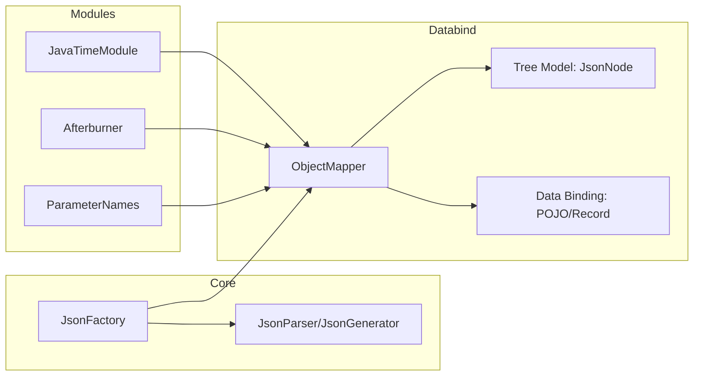

2025-10-22 20:29
Tags: #

Цель раздела — дать профессионально строгую, но практичную основу по работе с JSON в экосистеме Java: _потоковые API, древовидная модель, data binding_, конфигурация, модули, особенности времени/дат, полиморфизм, безопасность, интеграции.  
Определения:
- **JLS** (Java Language Specification) определяет синтаксис и семантику языка Java и терминологию типов, конструкторов, записей (_records_), обобщений, модулей, исключений и т.п. Эти определения используются здесь, когда мы говорим о классах-моделях, видимости членов, сериализации записей и др.
- **Документация Oracle JDK** определяет стандартные API (`java.io`, `java.time`, `java.util`, `java.util.spi`, `java.lang.Record`, модули JPMS), а также инструменты (например, `jlink`, локализация, кодировки, `Charset`, JFR и др.). Мы опираемся на эти определения при обсуждении потоков ввода/вывода, кодировок, локалей и времени.

## Формальные определения (используемые в тексте)
- **Сериализация (в общем смысле)** — преобразование значения объектов Java и их графа в последовательность байтов или текстовое представление (в данном разделе — `JSON`).
- **Десериализация** — обратное преобразование `JSON` в значения объектов Java, удовлетворяющее правилам типов (JLS §4–§5: типы, преобразования, контексты).
- **Data Binding** — сопоставление полей/свойств Java-типов и элементов `JSON` по именам, типам и аннотациям (`Jackson/Gson`), с учётом модификаторов доступа, видимости, конструкторов (JLS §8), записей (JLS §12), массивов и дженериков (JLS §13, §18).
- **Потоковая обработка** — чтение/запись JSON последовательности как токенов без промежуточной материализации модели в память.

## [[58.1. ObjectMapper и Jackson Core Concepts DRAFT]]

---

## 58.2. JSON → Object (Deserialization)

## 58.2.1. Соответствие типов и конструктора

- Для POJO Jackson использует:
    
    - **конструктор по умолчанию**, либо
        
    - **конструктор с аннотированными параметрами** `@JsonCreator/@JsonProperty`, либо
        
    - **record** (канонический конструктор) — сопоставление по именам (JLS §12 Records).
        
- Дженерики — требуются _реальные_ типовые аргументы (JLS §18). Используйте `TypeFactory` или `TypeReference`.
    

## 58.2.2. Неизвестные поля и адаптация схемы

- В интеграциях почти всегда:  
    `disable(DeserializationFeature.FAIL_ON_UNKNOWN_PROPERTIES)`.  
    Это позволяет пережить «расширение» протокола без падений.
    
- Для маппинга «гибких» структур используйте `JsonNode` и ручное чтение отдельных узлов.
    

## 58.2.3. Даты/время и локали

- Рекомендуется ISO-8601, `JavaTimeModule`, явная зона (`ZonedDateTime`) или `Instant` + `ZoneId` отдельно.
    
- Не опирайтесь на системный часовой пояс процесса при семантически важных данных.
    

## 58.2.4. Валидация

- Валидация на уровне **типов** (JLS §4–§5) выполняется самим байндингом.
    
- Бизнес-валидацию делайте после десериализации или через Bean Validation (Hibernate Validator) с аннотациями на моделях.
    

---

### ✔ Правильные примеры (3)

**(1) Простой список DTO**

```java
record User(String id, String name, Instant createdAt) {}

var mapper = new ObjectMapper()
    .registerModule(new JavaTimeModule())
    .disable(DeserializationFeature.FAIL_ON_UNKNOWN_PROPERTIES);

Path path = Path.of("users.json");
List<User> users = mapper.readValue(
    path.toFile(),
    mapper.getTypeFactory().constructCollectionType(List.class, User.class)
);
```

**(2) Карта со значениями-записями (records)**

```java
record Price(String sku, BigDecimal amount, String currency) {}

var mapType = mapper.getTypeFactory()
    .constructMapType(Map.class, String.class, Price.class);

Map<String, Price> prices = mapper.readValue(json, mapType);
```

**(3) Частичный разбор «как дерево», затем биндинг узла**

```java
JsonNode root = mapper.readTree(json);
JsonNode items = root.path("payload").path("items");
List<User> users = mapper.readerFor(new TypeReference<List<User>>(){}).readValue(items);
```

### ✖ Ошибочные примеры (2)

**(E1) Потеря типовой информации (raw type)**

```java
List<User> users = mapper.readValue(json, List.class); // компилируется!
// Runtime: List<Map> вместо List<User> → ClassCastException позже
```

**(E2) Отсутствие `JavaTimeModule`**

```java
record Event(Instant at, String name) {}
Event e = new ObjectMapper().readValue("{\"at\":\"2025-10-22T08:00:00Z\",\"name\":\"demo\"}", Event.class);
// JsonMappingException: Cannot construct instance of Instant
```

**Типичные ошибки и подводные камни**

- **Raw types** при коллекциях/картах → неверные типы на рантайме.
    
- Отсутствие `JavaTimeModule` → ошибки для `java.time`.
    
- `FAIL_ON_UNKNOWN_PROPERTIES` по умолчанию включен → падения при эволюции схемы.
    
- Неправильная зона или парсинг локализованных дат/чисел (используйте `Locale`, `DateTimeFormatter`).
    

---

# 58.3. Object → JSON (Serialization)

## 58.3.1. Контроль формы вывода

- Исключение `null` полей: `setSerializationInclusion(JsonInclude.Include.NON_NULL)`
    
- Читаемость: `writerWithDefaultPrettyPrinter()`
    
- Имена свойств: стратегия имён (`PropertyNamingStrategies.SNAKE_CASE`) или `@JsonProperty`
    

## 58.3.2. Даты/время (ISO-8601)

- Для совместимости: **отключить** `WRITE_DATES_AS_TIMESTAMPS` и **включить** `JavaTimeModule`.
    
- При необходимости форматировать на уровне поля: `@JsonFormat(pattern = "yyyy-MM-dd'T'HH:mm:ssXXX")`
    

## 58.3.3. Проекции, фильтры, Mix-in

- Ограничение набора полей: `@JsonIgnore` / `BeanPropertyFilter` / Jackson Views.
    
- Mix-in — способ добавить аннотации к типу, который вы не контролируете (библиотечные классы).
    

## 58.3.4. Потоковая запись больших объёмов

- Используйте `JsonGenerator` (`jackson-core`) или `SequenceWriter` из `ObjectWriter` для массивов без удержания всего в памяти.
    

---

#### ✔ Правильные примеры (3)

**(1) Красивый вывод и ISO-8601 даты**

```java
ObjectMapper mapper = new ObjectMapper()
    .registerModule(new JavaTimeModule())
    .disable(SerializationFeature.WRITE_DATES_AS_TIMESTAMPS)
    .setSerializationInclusion(JsonInclude.Include.NON_NULL);

String json = mapper.writerWithDefaultPrettyPrinter().writeValueAsString(myDto);
```

**(2) Выгрузка большого списка потоком**

```java
try (var out = Files.newBufferedWriter(Path.of("dump.json"), StandardCharsets.UTF_8)) {
  ObjectWriter w = mapper.writer();
  try (SequenceWriter seq = w.writeValuesAsArray(out)) {
    for (Record e : hugeStream()) {
      seq.write(e); // пишет элемент за элементом
    }
  }
}
```

**(3) Индивидуальный формат даты на поле**

```java
record Report(
  @JsonFormat(pattern="yyyy-MM-dd'T'HH:mm:ssXXX") ZonedDateTime generatedAt,
  String name) {}

String json = mapper.writeValueAsString(new Report(ZonedDateTime.now(), "Q4"));
```

#### ✖ Ошибочные примеры (2)

**(E1) Таймстемпы вместо ISO по умолчанию**

```java
ObjectMapper m = new ObjectMapper().registerModule(new JavaTimeModule());
String json = m.writeValueAsString(Instant.parse("2025-10-22T08:00:00Z"));
// По умолчанию: число эпохи → несогласованность с другими сервисами
```

**(E2) Сериализация чужого класса без Mix-in/настроек**

```java
// Библиотечный класс со скрытыми полями → пустые/лишние поля в JSON
String json = new ObjectMapper().writeValueAsString(thirdPartyObject);
// Не контролируете имена/видимость → неожиданный вывод
```

**Типичные ошибки и подводные камни**

- Непреднамеренные таймстемпы вместо ISO-8601.
    
- «Случайные» поля из-за стратегий видимости (getter’ы/boolean-префиксы).
    
- Сериализация больших коллекций «целиком» → пиковое потребление памяти (используйте потоковую запись).
    

---

### 58.3.5. Gson и Jakarta JSON (сопоставление кратко)

|Библиотека|Стиль|Плюсы|Минусы|Когда выбрать|
|---|---|---|---|---|
|**Jackson**|Data binding + Streaming + Tree|Самая полная функциональность, высокая скорость, богатые модули|Конфигурация сложнее, «острые края» безопасности при полиморфизме|Большинство продакшн-сервисов, большие объёмы|
|**Gson**|Data binding, дерево (`JsonElement`)|Простой старт, малый размер|Медленнее, слабая поддержка `java.time` по умолчанию|Лёгкие утилиты, внутренние инструменты|
|**Jakarta JSON (JSON-P/JSON-B)**|JSON-P: Streaming/DOM; JSON-B: binding|Стандарт Jakarta EE, интеграции с серверами приложений|Экосистема/производительность могут уступать Jackson|Jakarta EE-проекты, требующие стандартности|

---

## Схема (для Obsidian)



---

## Чек-листы

**Безопасность полиморфизма**

- Только явные `@JsonTypeInfo`/`@JsonSubTypes` для закрытых иерархий.
    
- Никогда не включать _default typing_ на внешних данных.
    
- Разделять доверенные/недоверенные источники.
    

**Даты/время**

- Всегда `JavaTimeModule`.
    
- Отключить `WRITE_DATES_AS_TIMESTAMPS`.
    
- Явно зафиксировать таймзону либо использовать `Instant` + `ZoneId` при отображении.
    

**Производительность**

- Один `ObjectMapper` на приложение.
    
- Потоковая запись/чтение при больших объёмах (`SequenceWriter`, `JsonParser`).
    
- Избегать промежуточных `String` для больших JSON (работать потоками).
    

---

## Краткие связки с JLS/Oracle API (формальные аспекты)

- **Типы и обобщения (JLS §4, §18)** — корректное указание целевых параметризованных типов при десериализации коллекций/карт.
    
- **Классы, конструкторы, записи (JLS §8, §12)** — правила соответствия параметров конструктора/record-компонентов JSON-полям.
    
- **Исключения (JLS §16)** — ошибки десериализации поднимаются как checked/unchecked (`IOException`, `JsonMappingException`) и должны быть корректно обработаны.
    
- **Стандартная библиотека Oracle (JDK):** `java.io`/`java.nio.file` для потоков и путей, `java.time` для времени, `Charset`/`Locale` для кодировок/локалей.
    

---

### Итог

- Используйте **один сконфигурированный `ObjectMapper`** c `JavaTimeModule`, явными фичами и контролируемой видимостью.
    
- Для **десериализации** — правильные типы (`TypeFactory`/`TypeReference`), терпимость к «лишним» полям, чёткая стратегия дат/времени.
    
- Для **сериализации** — ISO-8601, потоковые сценарии для больших данных, проекции и фильтры.
    
- Относитесь к **полиморфизму** как к потенциальной точке риска и придерживайтесь явных, закрытых схем.
    
- Выбор между **Jackson/Gson/Jakarta JSON** делайте по требованиям производительности, стандартности и экосистемы.


## Дополнения к 58.2 (десериализация) — уточнения по объёмам/типам

**MappingIterator для огромных массивов:**

```java
ObjectReader reader = mapper.readerFor(Item.class);
try (var in = Files.newInputStream(Path.of("big-array.json"));
     MappingIterator<Item> it = reader.readValues(in)) {
    while (it.hasNext()) {
        Item item = it.next();
        // обработка item
    }
}
```

**Иммутабельный тип с приватным конструктором:**

```java
final class Money {
  private final BigDecimal amount; private final String currency;
  @JsonCreator(mode = JsonCreator.Mode.PROPERTIES)
  Money(@JsonProperty("amount") BigDecimal amount,
        @JsonProperty("currency") String currency) {
    this.amount = amount; this.currency = currency;
  }
}
```

**✖ Ошибки (десериализация):**

- Raw-коллекции (`List.class`) → `List<Map>` и ClassCast позже.
    
- Ключи Map-ов не-строкового типа без кастомного key-deserializer → `JsonMappingException`.
    

---

## Дополнения к 58.3 (сериализация) — циклы, views, ключи Map

**Циклы ссылок (идентичность):**

```java
@JsonIdentityInfo(generator = ObjectIdGenerators.PropertyGenerator.class, property = "id")
class Node { public String id; public Node next; }

var mapper = new ObjectMapper();
String json = mapper.writeValueAsString(node); // сериализуется без бесконечной рекурсии
```

**Views/проекции:**

```java
class Views { static class Public {} static class Internal extends Public {} }

class User {
  @JsonView(Views.Public)   public String id;
  @JsonView(Views.Public)   public String name;
  @JsonView(Views.Internal) public String secret;
}

ObjectWriter publicW = mapper.writerWithView(Views.Public.class);
String pub = publicW.writeValueAsString(u); // secret отсутствует
```

**Ключи Map как ISO-датавремя:**

```java
SimpleModule m = new SimpleModule();
m.addKeySerializer(Instant.class, new JsonSerializer<Instant>() {
  @Override public void serialize(Instant value, JsonGenerator gen, SerializerProvider sp) throws IOException {
    gen.writeFieldName(value.toString());
  }
});
ObjectMapper mapper = new ObjectMapper().registerModule(m);
```

**✖ Ошибки (сериализация):**

- Случайные `boolean`-геттеры (`isXxx`/`getXxx`) → неожиданные поля.
    
- Запись огромного списка через `writeValueAsString` → всплеск памяти (используйте `SequenceWriter`/`JsonGenerator`).
    

---

## Подводные камни (сводка: Reader/Writer, Afterburner, JPMS)

- **ObjectReader/ObjectWriter** уже «заморожены»: меняйте конфигурацию маппера _до_ их получения.
    
- **Afterburner** может ускорить, но не всегда совместим с нативной компиляцией, сложными прокси и строгими политиками безопасности.
    
- **JPMS**: без `opens your.model.pkg to com.fasterxml.jackson.databind;` Jackson не увидит приватные поля/конструкторы; также следите за согласованностью версий модулей Jackson.
    

---

этот блок можно просто **вставить в твой раздел** после соответствующих подпунктов 58.1/58.2/58.3. Если хочешь, я сделаю «слияние» в единый цельный текст раздела прямо сейчас.