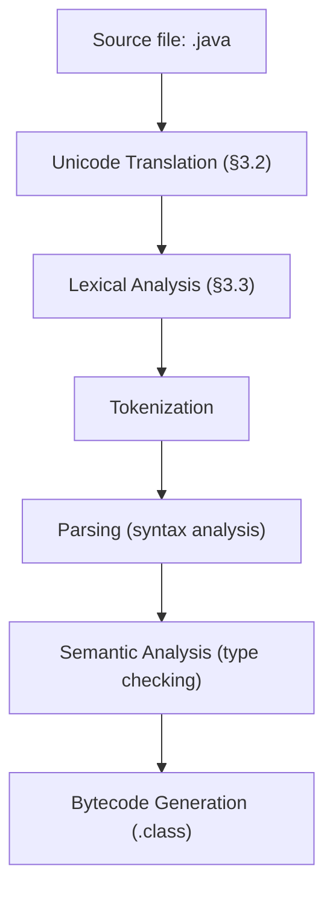

2025-11-16 14:56
Tags: #UnicodeTranslation #Literals 

Перед началом лексического анализа компилятор Java выполняет несколько стадий преобразования исходного текста. Эти стадии строго упорядочены и влияют на то, как интерпретируются комментарии, идентификаторы и строковые литералы.

## 3.10.0.1 Unicode Translation (§3.2)
На первом этапе компилятор выполняет `Unicode translation`.  
Все символы исходного файла переводятся в представление `Unicode`, и все `escape`-последовательности `\uXXXX` заменяются соответствующими символами ещё **до** анализа структуры программы.

Это означает, что:
- `Unicode`-последовательности интерпретируются даже **внутри комментариев и строк**,
- комментарии и токены могут измениться до лексического анализа,
- возможны неожиданные эффекты, если `\uXXXX` образует служебные символы (`/*`, `*/`, `//`, `;`, `if` и т. д.).

### Пример 1. Вскрытие комментария
```java
/*\u002a/ comment */
```

`\u002a` соответствует символу `*`, и строка превращается в:
```java
/**/ comment */
```

Комментарий закрывается преждевременно, и оставшаяся часть текста интерпретируется как код.

### Пример 2. Замена на ключевое слово
`Unicode translation` может изменить **смысл исполняемого кода**, если `escape`-последовательность заменяет ключевое слово:
```java
public class Test {
    public static void main(String[] args) {
        \u0069\u0066 (true) System.out.println("Hello!");
    }
}
```

- `\u0069` → `i`
- `\u0066` → `f`

После перевода компилятор видит:
```java
if (true) System.out.println("Hello!");
```

Код становится корректным и выполняется.

### Пример 3. Ошибка: Unicode ломает структуру
Иногда `Unicode escape` может **разрушить синтаксис программы**, если создаёт неожиданный служебный символ.
```java
public class Test {
    public static void main(String[] args) {
        System.out.println("Hello\u0022);  // ошибка
    }
}
```

`\u0022` — это символ `"` (кавычка).  
После стадии `Unicode translation` строка превращается в:
```java
System.out.println("Hello");  // ошибка
```

Компилятор теперь видит незакрытую кавычку, а `);` воспринимается как часть строки.  
Результат — **ошибка компиляции**: _unclosed string literal_.

## 3.10.0.2 Лексический анализ (§3.3)
После Unicode-преобразования выполняется **лексический анализ** (`lexical analysis`).  
На этой стадии поток символов разбивается на **токены** — минимальные единицы языка:
- идентификаторы (`variable`, `main`);
- ключевые слова (`class`, `if`);
- литералы (`123`, `"text"`);
- операторы (`+`, `==`);
- разделители (`;`, `{`, `}`).

Комментарии и пробелы при этом **игнорируются** и не формируют токены.

## 3.10.0.3 Tokenization и Parsing
Далее следует **синтаксическая фаза** (`parsing`) — компилятор объединяет токены в выражения, инструкции и блоки кода, проверяя грамматику Java.

> ⚠️ Важно: `Unicode escapes` обрабатываются **до** лексического анализа и могут **изменить структуру кода**, например превратить часть комментария в оператор, строковый литерал — в ошибку, или наоборот.

## Схема стадий компиляции Java



## Пояснения к стадиям

| Стадия                | Описание                                                                                         |
| :-------------------- | :----------------------------------------------------------------------------------------------- |
| `Unicode Translation` | Все `\uXXXX` последовательности заменяются на символы `Unicode`. Происходит до любых других фаз. |
| `Lexical Analysis`    | Поток символов превращается в последовательность токенов. Комментарии и пробелы игнорируются.    |
| `Tokenization`        | Формируются конкретные токены: ключевые слова, идентификаторы, операторы и литералы.             |
| `Parsing`             | Синтаксический анализ — токены объединяются в выражения и инструкции по грамматике Java.         |
| `Semantic Analysis`   | Проверяются типы, область видимости и логическая согласованность программы.                      |
| `Bytecode Generation` | После проверки создаётся байт-код `.class`.                                                      |
