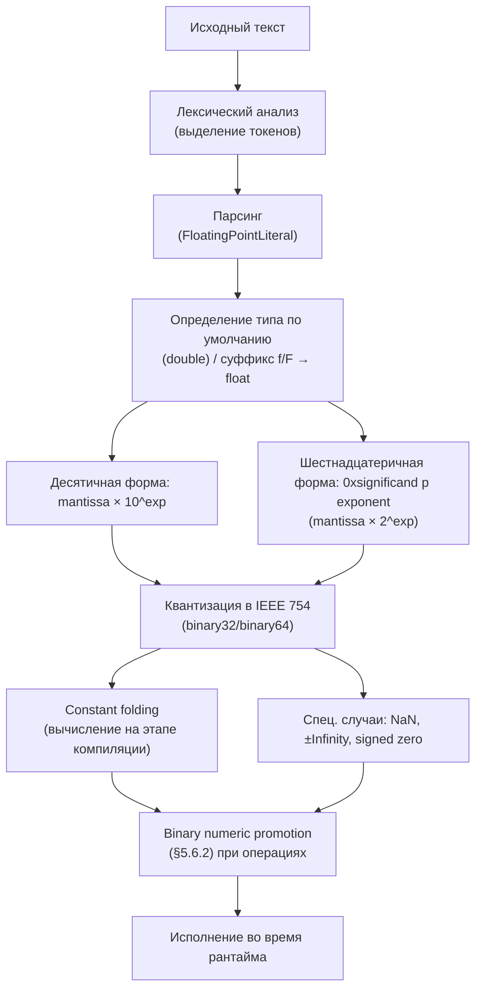
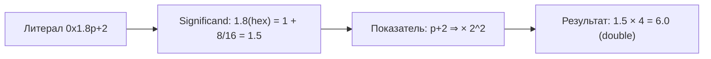

2025-11-16 15:31
Tags: #FloatingPointLiterals

Согласно `Java Language Specification` (§3.10.2), `FloatingPointLiteral` — это один из видов `Literal`:
```java
Literal:
    IntegerLiteral
    FloatingPointLiteral
    BooleanLiteral
    CharacterLiteral
    StringLiteral
    NullLiteral
```

`Floating-point literal` — это последовательность цифр (с возможным десятичным разделителем, экспонентой и/или префиксом), представляющая значение типов `float` или `double`.  
Тип по умолчанию — `double`; суффиксы `f` или `F` создают литерал типа `float`, а `d` или `D` (опциональны) — типа `double`.

## 3.10.2.1 Формы записи
```java
double pi = 3.1415;
float e = 2.71828f;
double exp = 1.23e3; // 1230.0
double hex = 0x1.0p4; // 16.0
```

> Литералы могут использовать десятичную или шестнадцатеричную запись.  
> В обоих случаях допускается использование экспоненты: `e`/`E` — для десятичной, `p`/`P` — для шестнадцатеричной формы.

## 3.10.2.2Hexadecimal Floating-Point Literals
Java поддерживает шестнадцатеричные литералы для `float` и `double` (§3.10.2):

```java
double v = 0x1.0p-3; // 0.125
```

Формат:
```
0x<significand>p<exponent>
```

> 💡 Это обеспечивает точное управление битовым представлением числа и используется в тестах IEEE 754 и численных библиотеках.

## 3.10.2.3 IEEE 754 и signed zeros
Все значения `float` и `double` следуют стандарту **IEEE 754**.  
В частности, нули имеют знак:
```java
double pz = +0.0;
double nz = -0.0;
System.out.println(1.0 / pz); // Infinity
System.out.println(1.0 / nz); // -Infinity
```

> В Java +0.0 и -0.0 различаются при делении, но равны при сравнении (`+0.0 == -0.0` → true).  
> ⚠️ Особенность: `NaN` **не равно самому себе** (`NaN != NaN` → `true`).  
> Для проверки используйте `Double.isNaN(x)` или `Float.isNaN(x)`.

## 3.10.2.4 Специальные значения: NaN и Infinity
`NaN (Not-a-Number)` и `±Infinity` — специальные значения `IEEE 754` для `float/double`.

### Происхождение `NaN` и `±Infinity`
```java
double a = 1.0 / 0.0;    // Infinity
double b = -1.0 / 0.0;   // -Infinity
double c = 0.0 / 0.0;    // NaN
double d = Math.sqrt(-1);// NaN
double e = Double.POSITIVE_INFINITY - Double.POSITIVE_INFINITY; // NaN
double f = 0.0 * Double.POSITIVE_INFINITY; // NaN
```

### Сравнения и распространение `NaN`
- `NaN` **не равно самому себе**: `NaN != NaN` → `true`.  
Используйте `Double.isNaN(x)` / `Float.isNaN(x)`:
```java
double x = 0.0 / 0.0;
System.out.println(x == x);          // false
System.out.println(Double.isNaN(x)); // true
```  
- Любая арифметическая операция с `NaN` даёт `NaN`.
- `+0.0 == -0.0` → `true`, но отличаются при делении и сравнении через `Double.compare`.

### Сортировка, сравнение и равенство объектов
```java
System.out.println(Double.compare(Double.NaN, 0.0));    // > 0 (NaN "больше")
System.out.println(Double.compare(-0.0, +0.0));         // < 0
System.out.println(Double.valueOf(Double.NaN)
    .equals(Double.valueOf(Double.NaN))); // true (объектное равенство)
```

- `Double.compare`/`Float.compare` упорядочивают `NaN` как **наибольшее** значение; `-0.0` считается **меньше** `+0.0`.
- В то же время оператор `==` для примитивов: `NaN == NaN` → `false`.
- `Double.equals/Float.equals` для **объектов** считают два `NaN` равными.

### Парсинг и проверка бесконечностей
```java
System.out.println(Double.parseDouble("NaN"));       // NaN
System.out.println(Double.parseDouble("Infinity"));  // Infinity
System.out.println(Double.isInfinite(1.0 / 0.0));    // true
System.out.println(Double.isFinite(1.0));            // true (Java 8+)
```

>`parseDouble`/`valueOf` принимают строки `"NaN"`, `"Infinity"`, `"-Infinity"`.

### Поведение стандартных функций
```java
System.out.println(Math.min(Double.NaN, 5.0)); // NaN
System.out.println(Math.max(2.0, Double.NaN)); // NaN
```

> `Math.min/max` возвращают `NaN`, если **любой** аргумент — `NaN`.

См. также:
- § 5.6.2 _Binary Numeric Promotion_ (влияние `NaN`/`Infinity` на вычисления)
- § 15.20 _Equality Operators_ (сравнения с `NaN`)

## 3.10.2.5 Диапазоны и нормализованные числа
Каждый тип реализует диапазон значений `IEEE 754 binary32 (float)` и `binary64 (double)`:
```java
System.out.println(Float.MAX_VALUE);   // 3.4028235E38
System.out.println(Float.MIN_VALUE);   // 1.4E-45 (денормализованное)
System.out.println(Double.MIN_NORMAL); // 2.2250738585072014E-308
```

|Тип|Минимум (нормализ.)|Максимум|Разрядность|Формат|
|:--|--:|--:|:--|:--|
|`float`|~1.175 × 10⁻³⁸|3.402 × 10³⁸|32 бита|IEEE 754 binary32|
|`double`|~2.225 × 10⁻³⁰⁸|1.797 × 10³⁰⁸|64 бита|IEEE 754 binary64|

> Денормализованные (`subnormal`) числа позволяют плавно представлять значения между `0` и `MIN_NORMAL`.

## 3.10.2.6 Constant folding и специальные значения
Как и в целочисленных литералах, компилятор вычисляет выражения с `float` и `double` **на этапе компиляции** (`constant folding`):
```java
final double X = 1.5 * 2.0; // 3.0
final double NAN = 0.0 / 0.0; // NaN
System.out.println(Double.isNaN(NAN)); // true
```

> Операции с `NaN` всегда дают `NaN`, а любые сравнения с ним (`==`, `<`, `>`) возвращают `false`.  
> Специальные значения IEEE 754:
> - `NaN` — Not a Number
> - `+Infinity`, `-Infinity` — положительная и отрицательная бесконечность

## 3.10.2.7 Numeric promotion
При участии `float` и `double` в выражениях действуют правила _binary numeric promotion_ (§5.6.2):
- Если один операнд имеет тип `double`, второй неявно приводится к `double`.
- Если один `float`, а другой — целый тип (`int`, `long` и т. д.), он приводится к `float`.
- Арифметика всегда выполняется в более широком формате.

Пример:
```java
float f = 1.0f;
double d = 2.0;
System.out.println(f + d); // результат double
```

## 3.10.2.8 Потеря точности
```java
System.out.println(0.1 + 0.2 == 0.3); // false
```

Числа с плавающей точкой не могут точно представить все десятичные дроби, так как их внутреннее представление — двоичное.

Для финансовых и точных вычислений рекомендуется использовать `BigDecimal`:
```java
import java.math.BigDecimal;

BigDecimal a = new BigDecimal("0.1");
BigDecimal b = new BigDecimal("0.2");
System.out.println(a.add(b)); // 0.3
```

## 3.10.2.9 Сводка правил

| Особенность             | Пример             | Примечание                |
| :---------------------- | :----------------- | :------------------------ |
| Десятичная форма        | `3.14`, `2e-3`     | тип `double` по умолчанию |
| Суффикс `f/F`           | `1.0f`             | тип `float`               |
| Суффикс `d/D`           | `1.0d`             | опционален                |
| Шестнадцатеричная форма | `0x1.0p4`          | `16.0`                    |
| Signed zeros            | `+0.0`, `-0.0`     | различаются при делении   |
| Специальные значения    | `Infinity`, `NaN`  | из IEEE 754               |
| Потеря точности         | `0.1 + 0.2 != 0.3` | используйте `BigDecimal`  |

## 3.10.2.10 Схема интерпретации floating-point литералов



### Мини-схема для шестнадцатеричной формы



### Диапазоны констант в Java API

|Тип|Мин. нормализ.|Макс. значение|Спец. константы|
|:--|--:|--:|:--|
|`float`|`1.17549435E-38F`|`3.4028235E38F`|`Float.NaN`, `Float.POSITIVE_INFINITY`, `Float.NEGATIVE_INFINITY`|
|`double`|`2.2250738585072014E-308`|`1.7976931348623157E308`|`Double.NaN`, `Double.POSITIVE_INFINITY`, `Double.NEGATIVE_INFINITY`|

### Резюме
- `Floating-point` литералы представляют значения `float` и `double` в десятичной или шестнадцатеричной форме.
- Тип по умолчанию — `double`; суффиксы `f/F` задают `float`.
- Поддерживается стандарт IEEE 754 со всеми специальными значениями (`NaN`, `Infinity`, signed zeros`).
- Компилятор выполняет `constant folding` для выражений с литералами.
- При смешанных вычислениях действует правило `binary numeric promotion`.
- Для точных арифметических операций используйте `BigDecimal`.
