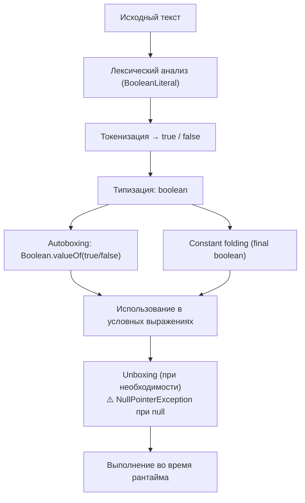

2025-11-16 16:08
Tags: #BooleanLiterals

Согласно `Java Language Specification` (§3.10.3), `BooleanLiteral` — один из видов `Literal`
```java
Literal:
    IntegerLiteral
    FloatingPointLiteral
    BooleanLiteral
    CharacterLiteral
    StringLiteral
    NullLiteral

BooleanLiteral:
    true
    false
```

`true` и `false` — единственные допустимые булевы литералы, представляющие два возможных значения типа `boolean`.

### Примеры
```java
boolean ready = true;
boolean done = false;
if (ready) {
    System.out.println("Готово!");
}
```

> В отличие от C/C++, в Java нельзя использовать числа вместо `boolean`.  
> Например, `if (1)` вызовет ошибку компиляции.

## 3.10.3.1 Autoboxing и Boolean.valueOf()
При автопаковке (`autoboxing`) примитив `boolean` преобразуется в объект `Boolean` через метод `Boolean.valueOf()`.  
Этот метод **не создаёт новые экземпляры**, а возвращает одну из двух констант `Boolean.TRUE` или `Boolean.FALSE`.
```java
Boolean a = true;                   // autoboxing
Boolean b = Boolean.valueOf(true);  // тот же объект
System.out.println(a == b);         // true
```

> Таким образом, `Boolean.valueOf()` всегда возвращает кэшированные значения.  
> Это гарантируется спецификацией; объекты `Boolean` не создаются заново.

## 3.10.3.2 Nullability и Unboxing
Тип `boolean` — **примитив**, и не может быть `null`.  
Тип `Boolean` — **обёртка**, и может содержать `null`.  
При распаковке (`unboxing`) `null` вызывает `NullPointerException`:
```java
Boolean flag = null;
// if (flag) { } // NullPointerException
```

> При работе с обёртками рекомендуется использовать безопасные проверки:

```java
Boolean flag = null;
if (Boolean.TRUE.equals(flag)) {// безопасно, не вызовет NPE
}
```

## 3.10.3.3 Boolean и constant expressions
Булевы литералы могут участвовать в **константных выражениях**:
```java
final boolean FLAG = false;
if (FLAG) {
    // ...
}
```

> Такие выражения сворачиваются компилятором на этапе компиляции  
> и могут использоваться в аннотациях, `switch` или статических инициализаторах.

### Пример составного константного выражения
```java
final boolean OK = !false && true; // константа
```

## 3.10.3.4 Преобразование и парсинг строк
Для работы со строками класс `Boolean` предоставляет два метода с разным поведением:
```java
System.out.println(Boolean.parseBoolean("true"));  // true
System.out.println(Boolean.parseBoolean("TRUE"));  // true
System.out.println(Boolean.parseBoolean("yes"));   // false
```

> ⚠️ `Boolean.getBoolean(String name)` **не парсит строку**,  
> а читает **системное свойство** с указанным именем:

```java
// java -Ddebug=true ...
boolean debug = Boolean.getBoolean("debug");
```

## 3.10.3.5 Использование в логических выражениях
Булевы литералы — единственный тип, который можно использовать  
в условных выражениях (`if`, `while`, `for`, `do-while`)
```java
if (true) {
    System.out.println("всегда выполняется");
}
```

> Любое другое значение (например, число) приведёт к ошибке компиляции.

## 3.10.3.6 Сравнение и эквивалентность
Булевы значения можно сравнивать как по ссылке, так и по значению:
```java
Boolean a = true;
Boolean b = true;
System.out.println(a == b);      // true (кэш)
System.out.println(a.equals(b)); // true
```

> Для безопасных сравнений, где возможно `null`, используйте:

```java
if (Boolean.TRUE.equals(flag)) { ... } // безопасно
```

## 3.10.3.7 Сводка правил

|Особенность|Пример|Примечание|
|:--|:--|:--|
|Булевы литералы|`true`, `false`|единственные допустимые значения|
|Автопаковка|`Boolean a = true;`|возвращает `Boolean.TRUE` / `Boolean.FALSE`|
|Распаковка|`boolean b = Boolean.FALSE;`|выполняется автоматически|
|Null и unboxing|`Boolean x = null; if (x)`|`NullPointerException`|
|Безопасное сравнение|`Boolean.TRUE.equals(x)`|безопасно при `null`|
|Константные выражения|`final boolean FLAG = true;`|допускаются|
|Преобразование строк|`Boolean.parseBoolean("true")`|регистронезависимо|
|Системные свойства|`Boolean.getBoolean("prop")`|читает свойство JVM|
|Недопустимые выражения|`if (1)`|ошибка компиляции|

## 3.10.3.8 Схема интерпретации Boolean Literal



### Резюме
- Единственные булевы литералы — `true` и `false`.
- Тип по умолчанию — `boolean`, но через autoboxing возможна упаковка в `Boolean`.
- Упаковка выполняется методом `Boolean.valueOf()` с возвратом кэшированных экземпляров.
- `Boolean` может быть `null`; при unboxing `null` вызывает `NullPointerException`.
- Для безопасных сравнений используйте `Boolean.TRUE.equals(x)`.
- Булевы литералы участвуют в константных выражениях и могут использоваться в любых условных операторах.
- Для работы со строками используйте `Boolean.parseBoolean()`, а `Boolean.getBoolean()` предназначен для чтения системных свойств.
