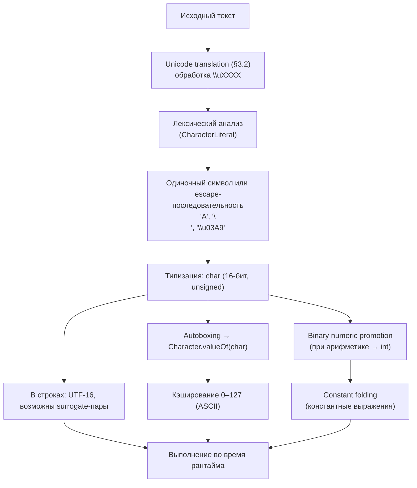

2025-11-17 07:35
Tags: #CharacterLiterals #Escape

Согласно `Java Language Specification` (§3.10.4), `CharacterLiteral` — один из видов `Literal`
```java
Literal:
    IntegerLiteral
    FloatingPointLiteral
    BooleanLiteral
    CharacterLiteral
    StringLiteral
    NullLiteral

CharacterLiteral:
    'SingleCharacter'
    'EscapeSequence'
```

`char` — это **16-битный беззнаковый кодовый элемент UTF-16**,  
а не сам символ `Unicode`. Он хранит значение от `\u0000` до `\uffff` (0–65 535).

### Примеры
```java
char c = 'A';
char omega = '\u03A9'; // Ω
char newline = '\n';
```

> Литерал `char` всегда заключён в одинарные кавычки `' '`.  
> Допустим только один символ или `escape`-последовательность.

## 3.10.4.1 Диапазон и тип
```java
char min = '\u0000';
char max = '\uffff';
System.out.println((int) max); // 65535
```

> Тип `char` рассматривается как **целое беззнаковое значение** (`unsigned`).  
> При арифметике `char` неявно продвигается до `int`.
```java
char c = 'A';
int code = c + 1;       // binary numeric promotion → int
System.out.println(code);       // 66
System.out.println((char) code); // 'B'
```

## 3.10.4.2 Constant expressions
Литералы `char` могут участвовать в **константных выражениях** (§15.28).  
Такие выражения вычисляются компилятором во время компиляции и  
могут использоваться в `case`, аннотациях или статических инициализаторах.
```java
final char A = 'A';
final int X = 'A' + 1; // 66

switch ('B') {
    case A + 1 -> System.out.println("Match!");
}
```

> Компилятор выполняет `constant folding`, как и для числовых литералов.

## 3.10.4.3 Autoboxing и Character.valueOf()
Тип `char` может быть упакован в объект `Character` при помощи автопаковки.  
В этом случае используется метод `Character.valueOf()`, который кэширует символы в диапазоне `\u0000–\u007F` (0–127, ASCII).
```java
Character ch1 = 'A';
Character ch2 = Character.valueOf('A');
System.out.println(ch1 == ch2); // true (кэш)
```

> Для символов за пределами ASCII создаются новые объекты.  
> Например, `Character.valueOf('Ω') != Character.valueOf('Ω')` может быть `true`.

## 3.10.4.4 Escape-последовательности

|Последовательность|Значение|
|:--|:--|
|`\n`|новая строка|
|`\t`|табуляция|
|`\b`|забой|
|`\r`|возврат каретки|
|`\f`|переход страницы|
|`\\`|обратная косая черта|
|`\'`|одинарная кавычка|
|`\"`|двойная кавычка|
|`\ddd`|октальный код (0–7, диапазон \000–\377)|
|`\uXXXX`|Unicode-код (hex)|

> Октальные escape-коды поддерживаются ради совместимости, но рекомендуется использовать `\uXXXX` для однозначности.

### Ошибки при неверных escape-последовательностях
```java
char bad = '\x41'; // ошибка: недопустимая escape-последовательность
```

> Допустимы только `\b`, `\t`, `\n`, `\f`, `\r`, `\"`, `\'`, `\\`, `\ddd` и `\uXXXX`.

## 3.10.4.5 Unicode и Code Points
Java `char` хранит **один кодовый элемент UTF-16**, но некоторые символы (U+10000 и выше) требуют **пары surrogate-элементов**.
```java
String s = "😀";
System.out.println(s.length()); // 2
System.out.println(s.codePointCount(0, s.length())); // 1
```

> `String.length()` возвращает количество кодовых элементов, а не количество символов `Unicode`.  
> Для подсчёта реальных символов используйте `codePointCount()`.

## 3.10.4.6 Ошибки и ограничения
- `char`-литерал не может быть пустым
```java
char c = ''; // ошибка компиляции
```
- Нельзя указать более одного символа в кавычках
- ```java
char c = 'AB'; // ошибка
```
- `Unicode-escape`-последовательности `\uXXXX` раскрываются **до** лексического анализа (§3.2).  
Это значит, что `'\u0027'` интерпретируется как `'\'`.

## Сводка правил

|Особенность|Пример|Примечание|
|:--|:--|:--|
|Одиночный символ|`'A'`|тип `char`|
|Escape-последовательность|`'\n'`, `'\t'`|стандартные спецсимволы|
|Unicode-escape|`'\u03A9'`|Ω|
|Октальный код|`'\141'`|`'a'` (устар.)|
|Диапазон|`'\u0000'` – `'\uffff'`|0 – 65 535|
|UTF-16 surrogate|`"😀".length() == 2`|один символ → два `char`|
|Арифметика|`'A' + 1`|результат `int`|
|Константные выражения|`final int X = 'A' + 1;`|вычисляются на этапе компиляции|
|Автопаковка|`Character ch = 'A';`|кэш в диапазоне `0–127`|
|Ошибки|`char c = '';`|пустой литерал недопустим|

## 3.10.4.7 Схема интерпретации Character Literal


## Резюме
- `char` представляет **один 16-битный кодовый элемент UTF-16**, а не полный Unicode-символ.
- Диапазон значений — от `\u0000` до `\uffff`.
- Тип `char` — **беззнаковый**, участвует в арифметике как `int`.
- `Character.valueOf()` кэширует ASCII-диапазон `0–127`.
- Escape-последовательности (`\n`, `\t`, `\uXXXX`) интерпретируются на этапе лексического анализа.
- Символы за пределами `U+FFFF` кодируются **парой surrogate-элементов**.
- `char`-литералы могут участвовать в **константных выражениях**, вычисляемых при компиляции.
- Рекомендуется использовать Unicode-escape `\uXXXX`, а не устаревшие октальные формы.
