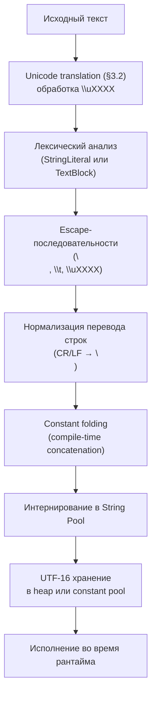

2025-11-17 07:57
Tags: #StringLiterals

Согласно **Java Language Specification (§3.10.5)**, `StringLiteral` — это последовательность символов `char`, заключённая в двойные кавычки.  
Строки в Java — **неизменяемые** объекты типа `String`, основанные на UTF-16.
```java
String s = "Java";
```

## 3.10.5.1 Unicode Translation и кодировка исходного файла
Перед разбором строковых литералов весь исходный текст переводится в `Unicode` (§3.2).  
Это значит, что кодировка исходного файла (`UTF-8`, `Windows-1251`, и др.) не влияет на внутреннее значение строки — к моменту компиляции все символы уже представлены в `Unicode`.

### Грамматика (JLS §3.10.5)
```java
Literal:
    ...
    StringLiteral

StringLiteral:
    "StringCharactersopt"

StringCharacters:
    StringCharacter
    StringCharacters StringCharacter

StringCharacter:
    InputCharacter но не " или \ или перевод строки
    EscapeSequence
```

## 3.10.5.2 Escape-последовательности

| Последовательность | Значение                                  |
| :----------------- | :---------------------------------------- |
| `\n`               | новая строка                              |
| `\t`               | табуляция                                 |
| `\b`               | забой                                     |
| `\r`               | возврат каретки                           |
| `\f`               | переход страницы                          |
| `\\`               | обратная косая                            |
| `\'`               | одинарная кавычка                         |
| `\"`               | двойная кавычка                           |
| `\ddd`             | октальный код (0–7, диапазон `\000–\377`) |
| `\uXXXX`           | Unicode-код (hex)                         |

> Unicode-escape раскрывается **до лексического анализа (§3.2)**, что может менять структуру кода до стадии токенизации.

Недопустимые escape-последовательности вызывают ошибку компиляции
```java
char bad = '\x41'; // ошибка: недопустимый escape
```

## 3.10.5.3 Нормализация перевода строк
Все варианты перевода строки (`\r`, `\r\n`, `\n`) нормализуются компилятором к `\n`.
```java
String s = "A\r\nB";
System.out.println(s.equals("A\nB")); // true
```

> Это обеспечивает переносимость исходников между ОС.

## 3.10.5.4 Пустая строка и отличие от `null`
```java
String empty = "";
System.out.println(empty.length()); // 0

String n = null;
System.out.println(empty == n); // false
```

> `""` — корректный литерал с длиной 0, `null` — отдельный литерал, не являющийся `String`.

## 3.10.5.5 Interning (строковый пул)
Все строковые литералы интернируются и попадают в **String Pool**, управляемый JVM.
```java
String a = "Java";
String b = "Java";
System.out.println(a == b); // true
```

> Интернирование выполняется во время загрузки класса. Строки, созданные через `new String("Java")`, не интернируются автоматически.

## 3.10.5.6 Compile-time concatenation и constant folding
Компилятор объединяет строковые литералы и константы при компиляции. Все остальные операции выполняются в рантайме через `StringBuilder`.
```java
String s1 = "A" + "B";      // compile-time: "AB"
String s2 = "A" + 1;        // compile-time: "A1"
String s3 = "A" + variable; // runtime через StringBuilder
```

Эквивалент сгенерированного байткода
```java
new StringBuilder().append("A").append(variable).toString();
```

> Только строковые литералы и `final`-константы участвуют в compile-time concatenation.

## 3.10.5.7 Unicode и surrogate-пары
Строка хранит **последовательность `char`**, а не `code point`. Символы за пределами BMP (`U+FFFF`) кодируются парой `char` (`surrogates`).
```java
String s = "😀";
System.out.println(s.length());            // 2
System.out.println(s.codePoints().count()); // 1
```

> Для подсчёта реальных символов используйте `codePoints()` или `codePointCount()`.

## 3.10.5.8 Constant Expressions
Строковые литералы и их конкатенации могут участвовать в константных выражениях (§15.28)
```java
final String HELLO = "Hello";
final String MSG = HELLO + " World";
System.out.println(MSG); // Hello World
```

> Такие выражения вычисляются на этапе компиляции  
> и включаются в constant pool байткода (`ldc`).

## 3.10.5.9 Text Blocks (JLS §3.10.6)
`Text Block` — многострочный строковый литерал, заключённый в тройные кавычки `"""`.
```java
String html = """
<html>
<body>Hello</body>
</html>
""";
```

### Основные правила
- Первый перевод строки после открытия `"""` игнорируется.
- Отступы вычисляются по минимальному числу пробелов в строках.
- Пробелы перед закрывающими `"""` игнорируются.
- Символ `\` в конце строки удаляет перевод (`line continuation`).
- `\s` обозначает пробел (для визуального выравнивания).
- Для включения `"""` внутрь блока используется `\"""`.

Пример
```java
String query = """
    SELECT *
    FROM users
    WHERE name = "John" \
    AND active = true;
    """;

String quoted = """
    This is a \"\"\"quoted\"\"\" block
    """;
```

### Демонстрация автоотступа
```java
String json = """
        {
          "id": 1,
          "name": "Alice"
        }
        """;
System.out.println(json);
// {
//   "id": 1,
//   "name": "Alice"
// }
```

## 3.10.5.10 Отличия String Literal vs Text Block

|Особенность|String Literal|Text Block|
|:--|:--|:--|
|Кавычки|`"..."`|`"""..."""`|
|Перенос строки|`\n`|прямой перевод|
|Автоотступы|нет|да|
|Игнор пробелов перед закрывающими `"""`|—|да|
|Escape `\"""`|—|допустимо|
|Line continuation (`\`)|да|да|
|Интернирование|да|да|
|Constant expression|да|да (если без `\`)|

## 3.10.5.11 Связь с String Templates (Java 21+, Preview)
Java 21 добавила `String Templates` (JEP 430), расширяющие синтаксис строк для интерполяции выражений без конкатенации:
```java
String name = "Java";
String s = STR."Hello, \{name}!";
System.out.println(s); // Hello, Java!
```

> String Templates не заменяют строковые литералы,  
> а дополняют их механизмами интерполяции и валидации.

## 3.10.5.12 Схема интерпретации String Literals



## Резюме
- `String` — неизменяемая последовательность `char` (UTF-16).
- `Unicode-translation` гарантирует независимость от кодировки файла.
- Пустая строка `""` отличается от `null`.
- Все строковые литералы интернируются JVM при загрузке класса.
- Компилятор объединяет строковые литералы при компиляции (`constant folding`).
- Переводы строк нормализуются к `\n`.
- Символы `Unicode` выше `U+FFFF` кодируются `surrogate`-парами.
- `Text Blocks` (`"""`) поддерживают многострочность и автоотступы.
- Для включения `"""` внутри блока используйте `\"""`.
- `Runtime`-конкатенации реализуются через `StringBuilder`.
- Строки участвуют в `constant expressions` и используются в аннотациях, `switch`, и `final` полях.
- Начиная с Java 21, доступны `String Templates (Preview)` для интерполяции.
