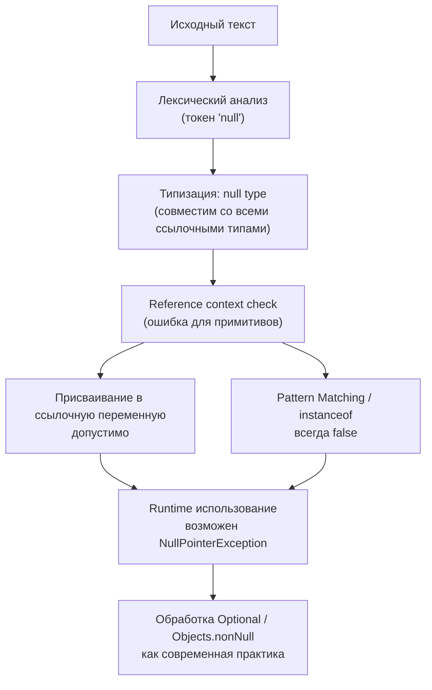

2025-11-17 10:30
Tags: #NullLiteral

`null` — это **единственный литерал**, обозначающий отсутствие ссылки.  
Он совместим со всеми ссылочными типами, но **не с примитивами**.
```java
String s = null;
List<Integer> list = null;
```

## 3.10.6.1 Грамматика (JLS §3.10.7)
```java
Literal:
    ...
    NullLiteral

NullLiteral:
    null
```

> `null` — самостоятельный токен и ключевое слово. Пишется строчными буквами; `Null` или `NULL` — ошибка компиляции.

## 3.10.6.2 Null Type
> 💡 `null` имеет собственный «null type» (§4.1) — безымянный тип, совместимый со всеми ссылочными типами, но **не совместимый** с примитивами (`int`, `boolean` и т. д.).

```java
Object o = null;     // корректно
String s = o;        // корректно — совместимо
int x = null;        // ошибка — примитив
```

Тип `null` имеет единственное значение — само `null`, не может быть объявлен явно и используется только для выражения «отсутствия значения».

## 3.10.6.3 Reference Type Context (§5.2)
> Значение `null` допустимо только в контексте ссылочного типа. Попытка присвоить его переменной примитивного типа приводит к ошибке компиляции.

```java
String s = null; // корректно
int n = null;    // ошибка: несоответствие типов
```

## 3.10.6.4 Присваивания и конверсии
Значение `null` можно присваивать любому ссылочному типу, а также использовать в условных выражениях, если контекст определяет результирующий тип.
```java
String s = (true ? null : "X");   // тип String
Number n = (false ? 1 : null);    // тип Number
```

> Тип результата вычисляется по _наиболее специфичному общему типу_ (§15.25).

### Пример с Generics
```java
class Box<T> {
    T value = null;
}
Box<String> b = new Box<>();
```

> `null` безопасно присваивается любому параметризованному типу, так как не содержит информации о типовом аргументе.

## 3.10.6.5 Сравнение и NullPointerException
```java
String a = null, b = null;
System.out.println(a == b);      // true
System.out.println(a != null);   // false
// System.out.println(a.equals(b)); // NPE
```

> Сравнение `==` и `!=` корректно для `null`, но вызов методов (`a.equals(b)`) на `null` вызывает `NullPointerException`.

## 3.10.6.6 Pattern Matching и `instanceof`
`null instanceof T` всегда возвращает `false`.
```java
String s = null;
System.out.println(s instanceof String); // false
```

> При pattern matching (`instanceof T var`) `null` не сопоставляется ни с одним шаблоном. В Java 21 добавлена возможность явно обрабатывать `null` в `switch`.

```java
switch (s) {
    case null -> System.out.println("Null value");
    case String str -> System.out.println("String: " + str);
}
```

До Java 21 попытка передать `null` в `switch` приводила к `NullPointerException`.

## 3.10.6.7 Автоупаковка и NPE
```java
Integer i = null;  // допустимо
int x = i;         // NullPointerException
```

> При распаковке `null` возникает `NullPointerException`. Автопаковка (`int → Integer`) не выполняется в обратную сторону.

Современные API используют аннотации `@Nullable` и `@NonNull` для статического анализа возможных `null`-значений.

## 3.10.6.8 Constant Expressions
```java
final String A = null; // допустимо
```

> Литерал `null` может входить в состав константных выражений, но сам по себе не делает выражение compile-time constant (§15.28).

## 3.10.6.9 Optional и современные практики
```java
Optional<String> name = Optional.ofNullable(null);
System.out.println(name.isPresent()); // false
```

> Вместо возврата `null` современные API часто используют `Optional`,  
> особенно когда «отсутствие значения» — нормальный сценарий.

## 3.10.6.10 Objects.isNull / Objects.nonNull
```java
Stream.of("a", null, "b")
      .filter(Objects::nonNull)
      .forEach(System.out::println);
```

> Методы `Objects.isNull()` и `Objects.nonNull()` удобны для Stream API и позволяют избежать прямого сравнения с `null`.

### Сводка

| Особенность           | Пример                         | Комментарий                     |
| :-------------------- | :----------------------------- | :------------------------------ |
| Литерал               | `null`                         | обозначает отсутствие ссылки    |
| Тип                   | `null type`                    | подтип всех ссылочных типов     |
| `Reference Contex`t   | `String s = null;`             | только ссылочные типы           |
| Примитивы             | `int x = null;`                | ошибка компиляции               |
| `instanceof`          | `null instanceof T`            | `false`                         |
| `switch`              | `case null ->`                 | обрабатывается явно (с Java 21) |
| Сравнение             | `a == b`, `a != null`          | безопасно                       |
| `equals(`)            | `a.equals(b)`                  | `NullPointerException`          |
| Автоупаковка          | `Integer i = null; int x = i;` | `NullPointerException`          |
| `Generics`            | `T value = null;`              | допустимо                       |
| `Constant Expression` | `final String S = null;`       | не делает constant              |
| `Optional`            | `Optional.ofNullable(null)`    | безопасная альтернатива         |
| `Objects.nonNull`     | `filter(Objects::nonNull)`     | идиоматично для Stream API      |

## 3.10.6.11 Схема интерпретации `null` Literal



## Резюме
- `null` — ключевое слово и единственный литерал, обозначающий отсутствие ссылки.
- Имеет собственный `null type`, подтип всех ссылочных типов.
- Допустим только в `reference type context` (§5.2).
- В `instanceof` и pattern matching `null` всегда даёт `false`.
- В `switch` до Java 21 вызывал NPE, теперь обрабатывается через `case null`.
- При автоупаковке (`int → Integer`) распаковка `null` вызывает `NullPointerException`.
- Сравнение `==`/`!=` безопасно, `equals()` — нет.
- `null` может входить в `constant expression`, но не делает его `compile-time constant`.
- Используйте `Optional` и `Objects.nonNull()` для безопасного обращения с отсутствием значений.
