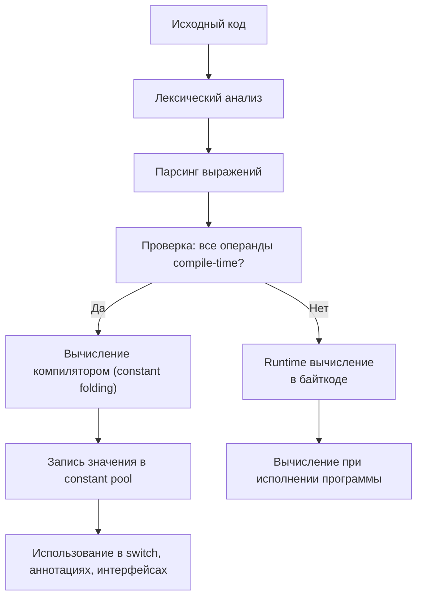

2025-11-17 11:06
Tags: #ConstantExpressions

`Constant expression` — это выражение, значение которого может быть вычислено компилятором на этапе компиляции (`compile-time`).  
Такие выражения подставляются в байткод в виде готовых значений и не вычисляются во время выполнения.

## 3.10.7.1 Определение (JLS §15.28)
> _A compile-time constant expression is an expression denoting a value that can be computed at compile time._

К compile-time constant expressions относятся:
- все литералы примитивных типов и `String` (`int`, `long`, `float`, `double`, `boolean`, `char`, `String`, `null`);
- арифметические и логические операции над константами (`+`, `-`, `*`, `/`, `%`, `&`, `|`, `^`, `<<`, `>>`);
- обращения к `final static` полям, если они инициализированы константным выражением.

### Примеры константных выражений
```java
final int A = 2;
final int B = 3;
final int C = A * B + 1; // compile-time constant

final double MAX = Double.POSITIVE_INFINITY;
final String MSG = "Ready";
```
> Компилятор вычисляет такие выражения во время компиляции и подставляет готовые значения в байткод.

### Примеры неконстантных выражений
```java
final double R = Math.random(); // не compile-time
int x = A + B;                  // не final
```
> Константность требует, чтобы **все операнды** были compile-time константами, а не результатами выполнения методов или вычислений во время исполнения.

## 3.10.7.2 Строковые выражения и конкатенация
Если обе части операции `+` — compile-time константы, результат тоже является константой:
```java
final String VERSION = "Java " + "21";
System.out.println(VERSION); // Java 21
```
> Компилятор объединяет строку при компиляции, результат попадает в _String Pool_ как единый литерал.

## 3.10.7.3 Использование в `switch` и аннотациях
В `switch` и в значениях аннотаций допускаются **только** `compile-time constants`.
```java
final int CODE = 200;
switch (CODE) {
    case 200 -> System.out.println("OK");
}
```

```java
@interface Info { String value(); }

@Info("StaticValue") // compile-time constant
class Example {}
```
> Значение должно быть известно компилятору — переменные и методы недопустимы.

## 3.10.7.4 Constant Fields в интерфейсах (§4.12.4)

> Все поля интерфейсов неявно `public static final` и должны быть compile-time constants.
```java
interface Config {
    int SIZE = 10;
}
System.out.println(Config.SIZE); // 10
```
> Компилятор встраивает такие значения напрямую в байткод всех классов,  
> использующих эти поля, даже без явного `final static`.

## 3.10.7.5 Static Import и подстановка значений
```java
import static java.lang.Math.PI;

final double R = 2 * PI; // compile-time constant
```

> При static import значение подставляется напрямую из `constant pool`,  
> а не вычисляется во время выполнения.

## 3.10.7.6 Ограничение по типам
> `Compile-time constant` выражения могут иметь только **примитивные** или **строковые** типы.
```java
final Object O = null; // корректно, но не compile-time constant
```
> Ссылочные типы (кроме `String`) не могут быть `compile-time constants`.

## 3.10.7.7 Поведение при переполнении
> Переполнение (`overflow`) в `compile-time` выражениях не вызывает ошибок — результат усечён по разрядности типа, аналогично `runtime`-арифметике (§15.17.2).
```java
final int X = 2_000_000_000 + 1_000_000_000; // overflow
System.out.println(X); // -1294967296
```

## 3.10.7.8 Enum constants в switch (§14.11)
> Метки `case` для `enum` также являются `compile-time` constants.
```java
enum Mode { AUTO, MANUAL }

Mode m = Mode.AUTO;
switch (m) {
    case AUTO -> System.out.println("Auto");
    case MANUAL -> System.out.println("Manual");
}
```

## 3.10.7.9 Constant Folding и Propagation
Компилятор выполняет:
- `constant folding` — вычисление выражений на этапе компиляции;
- `constant propagation` — подстановку результатов в другие классы.
```java
final int SIZE = 2 * 3 * 7; // 42 — подставляется в байткод
```
> JVM не пересчитывает эти значения во время загрузки — всё уже встроено компилятором.

## 3.10.7.10 Constant Pool и подстановка значений
Компилятор подставляет константы напрямую в `constant pool` класса.
```java
class A { static final int X = 10; }
class B { static final int Y = A.X; } // в байткоде Y = 10
```
> Изменение `A.X` без перекомпиляции `B` не изменит значение `Y`: оно уже встроено в байткод.

## 3.10.7.11 Таблица допустимых выражений

|Категория|Пример|Compile-time?|Комментарий|
|:--|:--|:-:|:--|
|Примитивные литералы|`42`, `3.14`, `true`|✅|вычисляются компилятором|
|Строки|`"Hello"`|✅|интернируются|
|`null`|`null`|✅|допустимо|
|`final static` поля|`final int A = 10`|✅|если инициализированы константой|
|Арифметика над константами|`2 * 3 + 1`|✅|допустимо|
|Enum constants|`case AUTO:`|✅|compile-time constant|
|`Math.random()`|❌|❌|runtime|
|`new String("Hi")`|❌|❌|создаёт объект|
|Побочные эффекты|`System.out.println(1)`|❌|не допускается|

## 3.10.7.12 Схема обработки constant expressions



## Резюме
- `Compile-time constant expression` — выражение, вычисляемое **компилятором**.
- Разрешены только **примитивные** и **строковые** типы.
- Используются в `switch`, `enum`, аннотациях, `final static` и интерфейсных полях.
- Компилятор выполняет `constant folding` и `propagation`, записывая значения в `constant pool`.
- При `static import` и ссылках на константы значения подставляются на этапе компиляции.
- Переполнение при вычислении не вызывает ошибок.
- JVM не пересчитывает такие выражения при загрузке класса.
