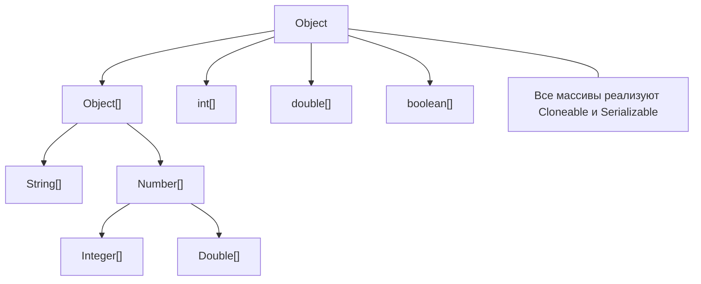
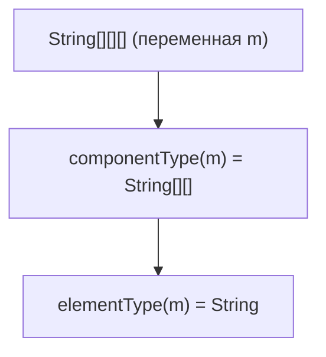

2025-11-04 13:02
Tags: #Array #toFormat 

## 13.1.1 Запись и глубина типов массивов

**Определение (JLS §10.1)**  
Тип массива записывается как базовый тип `T`, за которым следует `[]` столько раз, сколько измерений у массива. Длина массива **не входит** в тип.

**Пояснение**  
`int[]` — одномерный массив примитивов; `String[][]` — двумерный массив ссылок. Количество пар `[]` — _размерность_ (dimension). Конструкция вида `int[5]` (длина в объявлении типа) в Java синтаксически недопустима.

**Комментарий / Best practices**

- Всегда отделяйте **тип** и **длину**: тип — в объявлении, длина — при создании.
    
- Для читаемости придерживайтесь стиля `int[] a, b;` (а не `int a[], b;`).
    

### Примеры (корректные)

```java
int[] a;               // объявление типа одномерного массива
String[][] names;      // объявление типа двумерного массива ссылок
var m = new int[3][4]; // тип m — int[][]
```

### Примеры (ошибочные)

```java
int[5] a;              // ❌ syntax error: длина не входит в тип
String[] s = new String[][3]; // ❌ syntax error: нельзя задавать размер "с конца"
```

### Типичные ошибки и подводные камни

- Пытаться “закодировать” длину в типе (`int[5]`) — в Java это запрещено.
    
- Путать глубину (`T[][]`) и _элементный_ тип (см. далее).
    

---

## 13.1.2 Component type и Element type

**Определения (JLS §10.1)**

- **Component type** — тип непосредственных компонентов массива (`T[]` → `T`, `T[][]` → `T[]`).
    
- **Element type** — немассивный базовый тип, получаемый рекурсивно из component type (для `T[][][]` element type — `T`).
    

**Пояснение**  
Для `String[][][]` component type — `String[][]`, element type — `String`. Это различие важно для reflection и сериализации.

**Комментарий / Best practices**

- В reflection используйте `Class<?> c = arr.getClass(); c.getComponentType()` — он возвращает **component**, а не **element** тип.
    
- Для element-типа при многомерности потребуется несколько вызовов `getComponentType()`.
    

### Примеры (корректные)

```java
String[][][] cube = new String[2][3][4];
Class<?> c = cube.getClass();                  // [[ [ Ljava.lang.String;
Class<?> comp = c.getComponentType();          // [[Ljava.lang.String;  (component)
Class<?> elem = comp.getComponentType().getComponentType(); // java.lang.String (element)
```

```java
int[] ints = {1,2};
assert ints.getClass().getComponentType() == int.class;
```

```java
Object[] oa = new String[3];
assert oa.getClass().getComponentType() == Object.class; // переменная типа Object[], а реальный массив — String[]
```

### Примеры (ошибочные)

```java
Class<?> c = String[][].class;
c.getComponentType().equals(String.class); // ❌ false, component == String[], а не String
```

```java
Class<?> e = int[].class.getComponentType().getComponentType(); // ❌ NPE: второй getComponentType() вернёт null
```

### Типичные ошибки и подводные камни

- Путать **component** и **element** в reflection.
    
- Предполагать, что `getComponentType()` сразу вернёт немассивный тип.
    

---

## 13.1.3 Подтипность и ковариантность массивов

**Определение (JLS §4.10.3, §10.1)**  
Массивы **ссылочных** типов **ковариантны**: если `S` <: `T`, то `S[]` <: `T[]`. Массивы **примитивов** — **инвариантны**.

**Пояснение**  
Ковариантность позволяет присвоить `String[]` переменной `Object[]`. JVM при **каждой записи** в массив выполняет _array store check_ и при несоответствии бросает `ArrayStoreException`.

**Комментарий / Best practices**

- Не полагайтесь на ковариантность в публичных API; лучше использовать дженерики и коллекции.
    
- Если требуется общий супертип массива, чаще безопаснее работать с **копией** или `List<T>`.
    

### Примеры (корректные)

```java
String[] sa = new String[2];
Object[] oa = sa;       // ковариантность ссылочных массивов допустима
oa[0] = "ok";           // запись строки корректна
```

```java
Number[] na = new Integer[2]; // Integer[] <: Number[]
na[0] = Integer.valueOf(1);   // корректно
```

```java
int[] ia = new int[3];
Object o = ia; // примитивный массив — это Object (но НЕ Object[])
```

### Примеры (ошибочные)

```java
Object[] oa = new String[2];
oa[0] = Integer.valueOf(42); // ❌ runtime: ArrayStoreException
```

```java
Object[] po = new int[3]; // ❌ compile-time: int[] не подтип Object[]
```

### Типичные ошибки и подводные камни

- Ожидать, что `int[]` является `Object[]` — это неверно.
    
- Ловушка ковариантности: компилируется, но падает в runtime на записи чужого типа.
    

---

## 13.1.4 Примитивные vs ссылочные массивы

**Определение**

- Примитивные массивы (`int[]`, `double[]`) содержат **значения**.
    
- Ссылочные массивы (`String[]`, `Object[]`) содержат **ссылки** на объекты или `null`.
    

**Пояснение**  
Отличия влияют на потребление памяти, кэш-локальность и поведение копирования (копируются значения примитивов или ссылки на объекты).

**Комментарий / Best practices**

- В численных “горячих” путях используйте массивы примитивов — меньше аллокаций и накладных расходов GC.
    
- Помните, что копирование ссылочного массива копирует **ссылки**, а не объекты.
    

### Примеры (корректные)

```java
int[] xs = {1,2,3};
for (int i = 0; i < xs.length; i++) xs[i] *= 2;
```

```java
String[] ss = new String[3]; // по умолчанию элементы == null
ss[0] = "A";
```

```java
System.arraycopy(new int[]{1,2}, 0, new int[2], 0, 2); // копирование значений
```

### Примеры (ошибочные)

```java
int[] a = null; a.length; // ❌ NullPointerException
```

```java
Object[] oo = new int[2]; // ❌ compile-time: несоответствие типов
```

### Типичные ошибки и подводные камни

- Ожидать, что копирование ссылочного массива создаёт “глубокую” копию — копируются только **ссылки**.
    
- Забывать про `null` в ссылочных массивах после `new T[n]`.
    

---

## 13.1.5 Приведения и `instanceof`

**Определение (JLS §15.20.2, §5.5)**  
Массивы — **reifiable** типы: их полная типовая информация доступна в runtime; следовательно, `instanceof` и явные приведения для массивов корректны.

**Пояснение**  
`obj instanceof String[]` допустимо (тип массива известен JVM), тогда как `obj instanceof List<String>` — нет (type erasure).

**Комментарий / Best practices**

- Для проверок используйте `instanceof`, затем безопасный cast.
    
- Не пытайтесь проверять generic-параметры через `instanceof`.
    

### Примеры (корректные)

```java
Object o = new String[3];
if (o instanceof String[]) {
    String[] s = (String[]) o; // безопасно
}
```

```java
int[] ia = new int[2];
assert ia instanceof Object;   // true
assert !(ia instanceof Object[]); // true — примитивный массив не Object[]
```

```java
boolean b = (new Double[1]) instanceof Number[]; // true
```

### Примеры (ошибочные)

```java
Object o = new int[1];
Object[] x = (Object[]) o; // ❌ ClassCastException в runtime
```

```java
if (o instanceof List<String>) { } // ❌ compile-time: illegal generic instanceof
```

### Типичные ошибки и подводные камни

- Путать `Object` и `Object[]` при работе с примитивными массивами.
    
- Пытаться использовать `instanceof` с generic-аргументами.
    

---

## 13.1.6 Диагностика типов в runtime

**Определение**  
Каждый массив имеет свой `Class`-объект; внутренние имена JVM:  
`[I` — `int[]`, `[[D` — `double[][]`, `[Ljava.lang.String;` — `String[]`.

**Пояснение**  
`getName()` отдаёт внутреннюю сигнатуру; `getComponentType()` — component type верхнего уровня.

**Комментарий / Best practices**

- Для инструментирования/логирования используйте `getName()`/`getComponentType()`.
    
- Для динамического создания массивов применяйте `java.lang.reflect.Array`.
    

### Примеры (корректные)

```java
int[] a = new int[3];
System.out.println(a.getClass().getName()); // [I
```

```java
String[][] s = new String[1][];
System.out.println(s.getClass().getName()); // [[Ljava.lang.String;
System.out.println(s.getClass().getComponentType().getName()); // [Ljava.lang.String;
```

```java
Object arr = java.lang.reflect.Array.newInstance(String.class, 2);
System.out.println(arr.getClass().getName()); // [Ljava.lang.String;
```

### Примеры (ошибочные)

```java
Class<?> c = int.class;
c.getComponentType().getName(); // ❌ NPE: для немассивного типа componentType == null
```

```java
Class<?> k = String[].class;
String type = ((Class<?>) k.getComponentType().getComponentType()).getName(); // ❌ NPE: неправильное число раз
```

### Типичные ошибки и подводные камни

- Ожидать, что `getComponentType()` всегда немассивный — для многомерных он сам массив.
    
- Игнорировать `null` у `getComponentType()` для немассивных классов (int.class, String.class).
    

---

## 13.1.7 Reifiable и ограничения generic

**Определение (JLS §4.7, §10.1)**  
_Reifiable_ — тип, полностью доступный в runtime (включая массивы). _Generic_-типы — **не** reifiable из-за стирания типов.

**Пояснение**  
Нельзя создать `new List<String>[n]` (см. JLS запрет на generic array creation), но можно `new List<?>[n]` только с предупреждением — и это потенциально опасно (heap pollution).

**Комментарий / Best practices**

- Избегайте массивов generic-типов (`T[]`, `List<String>[]`). Используйте коллекции (`List<T>`).
    
- Если неизбежно — минимизируйте область применения и скрывайте за внутренним API.
    

### Примеры (корректные)

```java
String[] ok = new String[3];           // reifiable
Object[] cov = ok;                      // ковариантность ссылочного массива
```

```java
@SuppressWarnings("unchecked")
List<?>[] arr = (List<?>[]) new List[10]; // допустимо с предупреждением
```

```java
boolean r = (new String[0]) instanceof Object[]; // true
```

### Примеры (ошибочные)

```java
List<String>[] bad = new List<String>[10]; // ❌ compile-time: generic array creation
```

```java
<T> T[] make(int n) { return new T[n]; }   // ❌ compile-time: cannot create a generic array of T
```

### Типичные ошибки и подводные камни

- Создание массивов параметризованных типов — запрещено.
    
- Подмена безопасного API на varargs из generic (`@SafeVarargs` требуется осознанно и щадяще).
    

---

## 13.1.8 Нулевая инициализация и длина не в типе

**Определение (JLS §10.6)**  
Все элементы нового массива инициализируются значениями по умолчанию: для примитивов — `0`/`false`, для ссылок — `null`. Длина — `final`-поле `length`.

**Пояснение**  
Длина устанавливается при создании `new T[n]` и остается неизменной. `length` — поле, не метод.

**Комментарий / Best practices**

- Для “пустых” значений безопасно использовать массивы нулевой длины: `new T[0]`.
    
- Не путайте `arr.length` и несуществующий `arr.length()`.
    

### Примеры (корректные)

```java
int[] a = new int[3];     // {0,0,0}
String[] s = new String[2]; // {null, null}
```

```java
int[] empty = new int[0];
assert empty.length == 0;
```

```java
final int[] buf = new int[1024]; // длина фиксирована
```

### Примеры (ошибочные)

```java
int[] a = new int[3];
a.length = 4;          // ❌ compile-time: cannot assign a value to final field length
```

```java
int[] b = new int[2];
int n = b.length();    // ❌ compile-time: cannot find symbol (length — поле)
```

### Типичные ошибки и подводные камни

- Пытаться изменить длину массива — невозможно.
    
- Вызывать `length()` как метод — это поле.
    

---

## 13.1.9 Типобезопасность и runtime-проверки записи

**Определение (JLS §10.10, §15.13)**  
JVM выполняет **array store check** при записи в массив ссылочного типа; при несоответствии фактическому типу массива — `ArrayStoreException`.

**Пояснение**  
Компилятор проверяет тип **переменной**, JVM — **реальный тип** массива. Несоответствие обнаруживается только при выполнении.

**Комментарий / Best practices**

- Не публикуйте API, где вы принимаете/возвращаете ковариантные массивы; предпочитайте коллекции.
    
- Если нужно “обобщить” массив в `Object[]`, делайте **defensive copy**.
    

### Примеры (корректные)

```java
String[] sa = new String[2];
Object[] oa = sa;       // присваивание допустимо
oa[0] = "ok";           // запись совместимого типа
```

```java
Object[] any = new Object[2];
any[1] = Integer.valueOf(10);  // ok: реальный тип массива — Object[]
```

```java
Number[] nb = new Integer[1];
nb[0] = Integer.valueOf(1);    // ок, так как фактический массив — Integer[]
```

### Примеры (ошибочные)

```java
Object[] oa = new String[2];
oa[0] = new StringBuilder("x"); // ❌ ArrayStoreException (runtime)
```

```java
Number[] nb = new Integer[1];
nb[0] = Double.valueOf(1.0);   // ❌ ArrayStoreException (runtime)
```

### Типичные ошибки и подводные камни

- Полагаться на тип переменной вместо фактического типа массива.
    
- Считать, что компилятор “поймает” все ошибки записи — часть ловится только JVM.
    

---

## 13.1.10 Наглядные схемы (Mermaid)

### Подтипность и иерархия массивов



### Component vs Element (визуализация)



---

# Сводные Best Practices по разделу 13.1

1. **Тип vs длина**: длина задаётся только в `new T[n]`; тип — в объявлении.
    
2. **Ковариантность**: не публикуйте ковариантные массивы в API; используйте `List<T>`.
    
3. **Generic и массивы**: не создавайте массивы параметризованных типов.
    
4. **Reflection**: различайте `componentType` и `elementType`.
    
5. **Сравнение**: помните, что `equals()` у массивов — по ссылке; для содержания — `Arrays.equals/deepEquals`.
    
6. **Пустые коллекции**: `new T[0]` — допустимый “пустой” sentinel без `null`.
    
7. **Безопасность записи**: учитывайте _array store check_; возможен `ArrayStoreException`.
    
8. **Примитивные vs ссылочные**: в производительном коде предпочтительны примитивные массивы.
    

---

если нужно, в таком же формате подготовлю **13.2 “Array Variables”** — с диаграммой, формальными определениями, комментариями, корректными/ошибочными примерами и best practices.