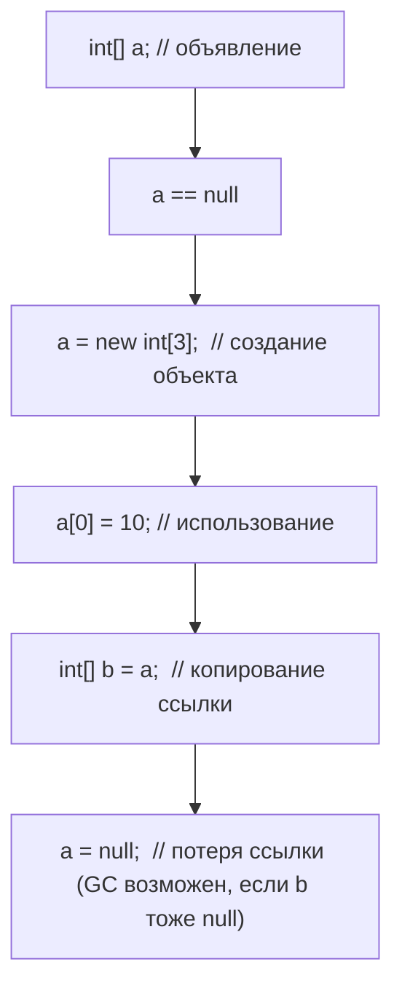
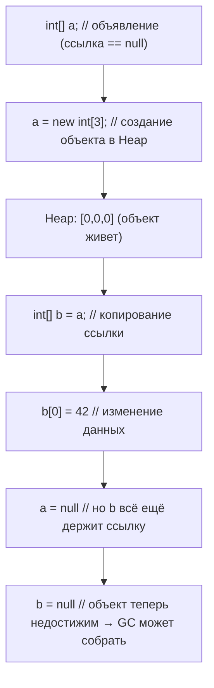

2025-11-04 13:03
Tags: #toFormat 


## 13.2.1 Формальное определение (JLS §10.2)

> An array variable is a variable that can hold a reference to an array object.  
> An array variable has a type that is an array type.  
> Declaring an array variable does not create an array — it only declares a reference capable of pointing to an array object.

**Определение**  
Переменная массива — это переменная, тип которой является _array type_, способная хранить ссылку на объект массива.

**Пояснение**  
При объявлении `int[] a;` не создаётся массив. Создаётся лишь ссылка `a`, имеющая значение `null`, пока ей не присвоен реальный объект массива.

**Комментарий / Best Practice**

- Разделяй **объявление** и **создание** массива: `int[] a; a = new int[5];`.
    
- Помни: объявление не выделяет памяти под элементы.
    

---

### Примеры (корректные)

```java
int[] a;                  // объявление ссылки
a = new int[3];           // создание объекта массива
String[] names = null;    // ссылка не инициализирована объектом
```

```java
double[][] matrix;        // двумерный массив
matrix = new double[2][2];
```

```java
Object[] arr = new String[2]; // ковариантное присваивание ссылочных массивов
```

### Примеры (ошибочные)

```java
int[] a;
int b = a[0]; // ❌ NullPointerException: a == null
```

```java
String s[];
s = {"A", "B"}; // ❌ syntax error: нужен new вне объявления
```

### Типичные ошибки и подводные камни

- Путать объявление с созданием объекта массива.
    
- Использовать переменную массива до инициализации (`NullPointerException`).
    

---

## 13.2.2 Definite Assignment и инициализация локальных переменных

**Определение (JLS §16)**  
Локальные переменные должны быть инициализированы _definitely assigned_ до первого использования.

**Пояснение**  
Компилятор проверяет, что переменная имеет присвоенное значение по всем путям выполнения до обращения к ней. Даже если теоретически присвоение произойдёт, но не гарантировано логикой, будет ошибка компиляции.

**Комментарий / Best Practice**

- Инициализируй массивы в момент объявления или в явной ветке `else`.
    
- Это compile-time проверка, отличная от `NullPointerException`.
    

### Примеры (корректные)

```java
int[] a = null;
if (System.currentTimeMillis() > 0)
    a = new int[1];
if (a != null)
    System.out.println(a.length);
```

```java
int[] b = new int[3];
System.out.println(b[0]);
```

```java
int[] c;
c = new int[2]; // явное присвоение до использования
System.out.println(c.length);
```

### Примеры (ошибочные)

```java
void f() {
    int[] a;
    if (System.currentTimeMillis() > 0)
        a = new int[1];
    System.out.println(a.length); // ❌ compile-time: a might not have been initialized
}
```

```java
void g() {
    int[] a;
    a[0] = 10; // ❌ compile-time: a might not have been initialized
}
```

### Типичные ошибки и подводные камни

- Путать compile-time ошибку неинициализации и runtime `NullPointerException`.
    
- Думать, что компилятор “понимает” логику условий — он требует доказуемой инициализации.
    

---

## 13.2.3 Множественные объявления и размещение `[]`

**Определение (JLS §8.3.2)**  
При множественном объявлении `[]` относится к той переменной, рядом с которой оно указано.

**Пояснение**  
`int a[], b;` — `a` типа `int[]`, `b` типа `int`.  
`int[] a, b;` — обе `int[]`.

**Комментарий / Best Practice**

- Используй форму `int[] a, b;` — она отражает тип явно и читаемо.
    
- Избегай C-подобного синтаксиса (`int a[], b;`).
    

### Примеры (корректные)

```java
int[] a, b;      // оба int[]
String[] x, y;   // оба String[]
```

```java
int a[], b;
a = new int[2]; b = 42;
```

```java
double[][] m1, m2; // оба двумерные массивы
```

### Примеры (ошибочные)

```java
int[] a, b[]; // ❌ b имеет тип int[][], не int[]
```

```java
float[] f = new float[3], g = {1,2,3}; // ❌ нельзя смешивать разные инициализации
```

### Типичные ошибки и подводные камни

- Разное количество `[]` в одной строке сбивает с толку.
    
- `int a[], b;` делает вторую переменную скалярной, что часто упускается.
    

---

## 13.2.4 Null и инициализация переменных массива

**Определение**  
Переменная массива — ссылка, по умолчанию инициализируется `null` (для полей и элементов других массивов). Локальные переменные не инициализируются автоматически.

**Пояснение**  
Обращение к элементам до присвоения массива вызывает `NullPointerException`.

**Комментарий / Best Practice**

- Используй `new T[0]` вместо `null` в публичных API.
    
- Проверяй массив на `null` перед использованием.
    

### Примеры (корректные)

```java
int[] data = null;
data = new int[5];
```

```java
String[] empty = new String[0]; // безопасный пустой массив
```

```java
private double[] values = new double[3]; // инициализация при объявлении поля
```

### Примеры (ошибочные)

```java
int[] a;
System.out.println(a.length); // ❌ compile-time: variable a might not have been initialized
```

```java
String[] s = null;
s[0] = "x"; // ❌ NullPointerException
```

### Типичные ошибки и подводные камни

- Возвращать `null` вместо пустого массива.
    
- Считать, что поля локально инициализируются по умолчанию — это справедливо только для полей класса.
    

---

## 13.2.5 `final` массивы

**Определение (JLS §4.12.4)**  
Модификатор `final` запрещает изменение ссылки, но не содержимого массива.

**Пояснение**  
`final int[] arr` можно изменять по элементам, но нельзя присвоить новую ссылку.

**Комментарий / Best Practice**

- Используй `final` для защиты ссылки, не данных.
    
- Для неизменяемых структур применяй `Collections.unmodifiableList(Arrays.asList(arr))` или копии.
    

### Примеры (корректные)

```java
final int[] nums = new int[3];
nums[0] = 42;      // ✅ разрешено
System.out.println(nums[0]);
```

```java
final String[] words = {"A","B"};
words[1] = "C";    // ✅ разрешено
```

```java
void test(final int[] x) { x[0] = 99; } // допустимо
```

### Примеры (ошибочные)

```java
final int[] nums = new int[3];
nums = new int[5]; // ❌ compile-time: cannot assign a value to final variable nums
```

```java
final String[] w = {"A","B"};
w = null; // ❌ compile-time: cannot assign a value to final variable w
```

### Типичные ошибки и подводные камни

- Думать, что `final` делает массив “immutable” — нет, изменяемость сохраняется.
    
- Не путай `final` ссылку и `final` значение.
    

---

## 13.2.6 Копирование, aliasing и shallow clone

**Определение**  
Присваивание массивной переменной копирует ссылку; обе переменные указывают на один объект.  
Метод `clone()` создаёт новый массив верхнего уровня, но **не копирует подмассивы** (shallow copy).

**Пояснение**  
Это ключевое различие для многомерных структур: `a.clone()` копирует лишь первый уровень.

**Комментарий / Best Practice**

- Для глубокого копирования многомерных массивов — рекурсивно или `Arrays.stream(...).map(...)`.
    
- Для защиты данных всегда возвращай копию.
    

### Примеры (корректные)

```java
int[] a = {1,2,3};
int[] b = a;         // alias
b[0] = 99;
System.out.println(a[0]); // 99
```

```java
int[] copy = a.clone();
copy[0] = 0;
System.out.println(a[0]); // 99 — оригинал не затронут
```

```java
int[][] m = {{1,2},{3,4}};
int[][] alias = m.clone();
alias[0][0] = 99;
System.out.println(m[0][0]); // 99 — shallow clone
```

### Примеры (ошибочные)

```java
int[] a = {1,2};
int[] b = a;
b = new int[]{3,4};
System.out.println(a[0]); // ❌ ожидание: 3, фактически: 1
```

```java
void bad(int[] arr) { arr = new int[]{0,0}; }
int[] d = {1,2};
bad(d);
System.out.println(d[0]); // ❌ ожидание: 0, фактически: 1
```

### Типичные ошибки и подводные камни

- Путать “копирование массива” и “копирование ссылки”.
    
- Полагаться на `clone()` для глубокого копирования многомерных массивов.
    

---

## 13.2.7 Использование в параметрах методов и varargs

**Определение (JLS §8.4.1, §8.4.3)**  
Объявления `void m(int x[])` и `void m(int[] x)` идентичны.  
Varargs (`void m(String... args)`) компилируется как `String[]`.

**Пояснение**  
Varargs — синтаксический сахар над массивами; внутри метода параметр всегда массив.

**Комментарий / Best Practice**

- При объявлении методов всегда предпочитай `T[]`, не `T x[]`.
    
- Не модифицируй varargs-параметры внутри метода — это общий массив.
    

### Примеры (корректные)

```java
void log(String... msgs) {
    System.out.println("count=" + msgs.length);
}
log();           // msgs == new String[0]
log("A","B");    // msgs == {"A","B"}
```

```java
void sum(int[] nums) { ... }
void sum(int nums[]) { ... } // идентично
```

```java
void combine(Object... vals) {
    Object[] arr = vals;
}
```

### Примеры (ошибочные)

```java
void print(String... a, String... b) {} // ❌ compile-time: only one varargs parameter permitted
```

```java
void bad(Object... objs) {
    objs[0] = 42; // ❌ возможно ClassCastException, если массив типа String[]
}
```

### Типичные ошибки и подводные камни

- Думать, что varargs создаёт List — это массив.
    
- Модификация varargs-параметра может нарушить типовую безопасность (heap pollution).
    

---

## 13.2.8 Reflection и метаданные переменных массива

**Определение (JLS §10.2 + §8.3)**  
Поле, имеющее тип массива, в Reflection отображается как `Field` с типом `Class` объекта массива.

**Пояснение**  
Методы `Field.getType()` и `Class.getComponentType()` позволяют определить тип массива и его компонентов.

**Комментарий / Best Practice**

- При анализе структуры классов через Reflection проверяй `isArray()`.
    
- Для многомерных массивов вызывай `getComponentType()` рекурсивно.
    

### Примеры (корректные)

```java
class Holder { int[] data; }
Field f = Holder.class.getDeclaredField("data");
System.out.println(f.getType().isArray()); // true
System.out.println(f.getType().getComponentType()); // int
```

```java
String[][] s = new String[1][];
System.out.println(s.getClass().getComponentType()); // class [Ljava.lang.String;
```

```java
Class<?> c = int[].class;
assert c.isArray();
assert c.getComponentType() == int.class;
```

### Примеры (ошибочные)

```java
Class<?> c = String.class;
c.getComponentType().getName(); // ❌ NPE: не массив
```

```java
Field f = Holder.class.getDeclaredField("data");
f.getType().getComponentType().getComponentType(); // ❌ NPE: только один уровень
```

### Типичные ошибки и подводные камни

- Игнорировать, что `getComponentType()` может вернуть `null`.
    
- Не проверять `isArray()` перед вызовом `getComponentType()`.
    

---

## 13.2.9 Диаграмма: жизненный цикл переменной массива



---

## 13.2.10 Сводные Best Practices

|Рекомендация|Пояснение|
|---|---|
|Отделяй объявление от создания|Явно видно, когда массив создаётся|
|Не полагайся на auto-init локальных переменных|Поля — да, локальные — нет|
|Используй `int[] a, b;`, не `int a[], b;`|Единообразный стиль|
|Возвращай `new T[0]`, а не `null`|Безопасно для итераций|
|Помни, что `final` не делает массив immutable|Меняются элементы|
|Для копий — `clone()` или `Arrays.copyOf()`|Защита от aliasing|
|Не модифицируй varargs|Риск heap pollution|
|При Reflection — проверяй `isArray()`|`getComponentType()` может вернуть null|


## 13.2.11 Область видимости и инициализация полей и локальных массивов

**Определение**  
Переменные массива могут быть полями класса, локальными переменными или параметрами метода.  
Их инициализация подчиняется общим правилам Java Memory Model и JLS §16 (Definite Assignment).

**Пояснение**

- **Поля** (instance или static) автоматически инициализируются `null`.
    
- **Локальные переменные** не инициализируются автоматически — компилятор требует явного присвоения.
    
- **Параметры** всегда считаются инициализированными при вызове метода.
    

**Комментарий / Best Practice**

- Никогда не используй локальные массивы до присвоения.
    
- Для безопасности публикуй в API пустой массив `new T[0]`, а не `null`.
    

### Примеры (корректные)

```java
class Example {
    int[] field;             // инициализируется null
    static String[] pool;    // инициализируется null

    void m() {
        int[] local = new int[3];  // инициализировано явно
        System.out.println(local.length);
    }
}
```

```java
class Demo {
    String[] names;           // = null по умолчанию
    void init() { names = new String[5]; }
}
```

```java
void print(int[] data) { System.out.println(data.length); } // параметр всегда инициализирован
```

### Примеры (ошибочные)

```java
void test() {
    int[] local;
    System.out.println(local.length); // ❌ compile-time: might not have been initialized
}
```

```java
class Bad {
    int[] arr;
    void run() { arr[0] = 1; } // ❌ NullPointerException: arr == null
}
```

### Типичные ошибки и подводные камни

- Путать инициализацию поля и локальной переменной.
    
- Не понимать, что JVM инициализирует только поля, а не локальные переменные.
    

---

## 13.2.12 Сравнение и присваивание ссылок массивов

**Определение**  
Операторы `==` и `!=` сравнивают ссылки на массивы, а не их содержимое.  
Метод `equals()` для массивов не переопределён (унаследован из `Object`).

**Пояснение**  
Два массива равны по `==`, только если они указывают на один объект.  
Для содержимого нужно использовать `Arrays.equals()` или `Arrays.deepEquals()` (для многомерных).

**Комментарий / Best Practice**

- Всегда используй методы `Arrays` для сравнения.
    
- Не используй `==` в бизнес-логике, если требуется сравнение данных.
    

### Примеры (корректные)

```java
int[] a = {1, 2};
int[] b = a;
System.out.println(a == b);        // true
System.out.println(Arrays.equals(a,b)); // true
```

```java
int[] x = {1, 2};
int[] y = {1, 2};
System.out.println(x == y);        // false
System.out.println(Arrays.equals(x,y)); // true
```

```java
String[][] m1 = {{"A"},{"B"}};
String[][] m2 = {{"A"},{"B"}};
System.out.println(Arrays.deepEquals(m1,m2)); // true
```

### Примеры (ошибочные)

```java
int[] a = {1, 2};
int[] b = {1, 2};
if (a == b) { /* ошибка логики */ } // ❌ сравнение по ссылке
```

```java
Object[] oa = new Object[]{new int[]{1,2}};
Object[] ob = new Object[]{new int[]{1,2}};
System.out.println(Arrays.equals(oa,ob)); // ❌ false (элементы — массивы)
```

### Типичные ошибки и подводные камни

- Считать, что `==` сравнивает значения — оно сравнивает ссылки.
    
- Не использовать `Arrays.deepEquals()` для многомерных структур.
    

---

## 13.2.13 Array Variables и управление памятью (Garbage Collection)

**Определение**  
Объект массива в куче собирается GC, когда на него не остаётся ни одной живой ссылки.  
Переменные массива — это ссылки на объекты, участвующие в графе достижимости.

**Пояснение**  
Удаление или переопределение переменной массива (например, `arr = null;`) освобождает объект для сбора, если на него не ссылаются другие переменные.  
Для больших массивов важно явно освобождать ссылки, чтобы ускорить сбор памяти.

**Комментарий / Best Practice**

- После использования больших массивов обнуляй ссылку, если объект больше не нужен.
    
- Не удаляй вручную — достаточно освободить ссылку (`arr = null`).
    
- Для ресурсоёмких массивов используй механизмы pooling или reuse.
    

### Примеры (корректные)

```java
int[] data = new int[1_000_000];
System.out.println(data.length);
data = null; // объект становится кандидатом для GC
```

```java
void process() {
    int[] cache = new int[100_000];
    use(cache);
    cache = null; // явное освобождение ссылки для ускорения GC
}
```

```java
WeakReference<int[]> ref = new WeakReference<>(new int[10_000]);
System.gc(); // массив может быть собран при отсутствии сильных ссылок
```

### Примеры (ошибочные)

```java
List<int[]> list = new ArrayList<>();
while (true) { list.add(new int[1000]); } // ❌ утечка памяти — ссылки живы
```

```java
int[] a = new int[1000];
int[] b = a;
a = null; // ❌ GC не сработает, пока b ссылается на массив
```

### Типичные ошибки и подводные камни

- Забывать, что GC не “удаляет переменные”, а освобождает недостижимые объекты.
    
- Считать, что `a = null;` немедленно удаляет массив.
    
- Создавать временные массивы в циклах без контроля объёмов памяти.
    

---

## Mermaid-схема жизненного цикла переменной массива (обновлённая)



---

## 13.2.14 Сводные Best Practices (дополнено)

|Рекомендация|Пояснение|
|---|---|
|Отделяй объявление от создания массива|Явно виден момент инициализации|
|Не используй неинициализированные локальные массивы|Компилятор контролирует Definite Assignment|
|Для API возвращай `new T[0]`, а не `null`|Безопаснее для итераций и стримов|
|Помни, что `final` не делает массив immutable|Элементы изменяемы|
|Используй `Arrays.equals()` или `deepEquals()`|`==` сравнивает ссылки|
|Очищай ссылки на большие массивы после использования|Снижаешь давление на GC|
|Не путай поля и локальные переменные|Поля автоинициализируются, локальные — нет|
|Передавай массивы в методы по ссылке, при нужде копируй|Избегаешь непреднамеренного aliasing|
|При Reflection проверяй `isArray()` перед `getComponentType()`|Безопасность метаданных|

---

## Вывод

Массивная переменная в Java — это ссылка на объект массива, чей жизненный цикл управляется JVM и Garbage Collector’ом.  
Её инициализация, область видимости, поведение при сравнении и копировании подчиняются строгим правилам JLS.  
Понимание этих аспектов необходимо для безопасной работы с памятью, оптимизации производительности и устойчивых API.

---

✅ Теперь раздел **13.2 полностью завершён**:  
он охватывает все аспекты JLS + JVM behavior + практику разработки, и может служить эталонной справочной главой для инженеров Java уровня Senior/Architect.