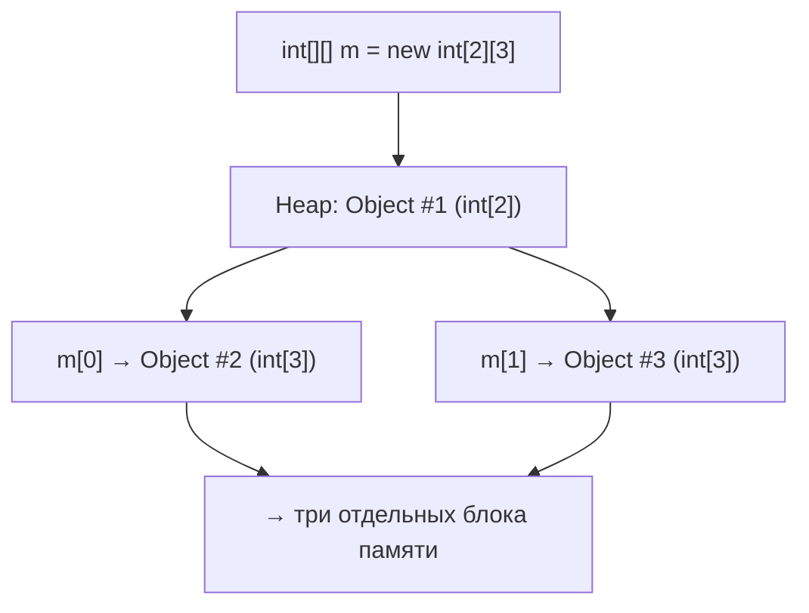
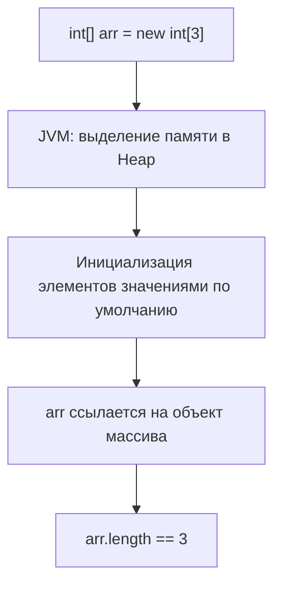

2025-11-04 13:04
Tags: #toFormat 

## 13.3.1 Формальное определение (JLS §10.3)

> An array creation expression creates a new array with specified component type and length.  
> It may specify array dimensions, provide an initializer, or both, subject to certain restrictions.

**Определение**  
Создание массива — это выражение, порождающее **новый объект массива** в куче.  
Массив создаётся оператором `new` с указанием типа компонента и длины (`new T[n]`),  
или с использованием **инициализатора массива** (`{...}`).

**Пояснение**  
Каждый массив имеет фиксированную длину, определяемую в момент создания.  
Эта длина сохраняется в объекте и доступна через поле `length`.

**Комментарий:**  
Создание массива — всегда runtime-операция, даже если размер известен во время компиляции.  
Массивы — полноценные объекты, а не “специальные структуры данных”.

---

## 13.3.2 Создание одномерных массивов

**Определение:**  
`new T[n]` создаёт массив длиной `n`, тип элементов — `T`.  
Каждый элемент инициализируется значением по умолчанию.

**Пояснение:**  
Размер `n` должен быть неотрицательным целым (`int`, `byte`, `short`, `char`).  
При отрицательном значении возникает `NegativeArraySizeException`.

### Примеры (корректные)

```java
int[] nums = new int[5];         // [0,0,0,0,0]
String[] names = new String[3];  // [null,null,null]
boolean[] flags = new boolean[2];// [false,false]
```

```java
char[] letters = new char[]{'A','B','C'}; // с инициализацией
```

```java
double[] values = new double[(int)Math.pow(2,3)]; // размер вычисляется
```

### Примеры (ошибочные)

```java
int size = -5;
int[] arr = new int[size]; // ❌ NegativeArraySizeException
```

```java
int n = 2.5; // ❌ compile-time: incompatible types
int[] x = new int[n];
```

### Комментарий и Best Practice

- Проверяй длину массива до выделения памяти.
    
- Для пустых результатов в API возвращай `new T[0]`, а не `null`.
    

---

## 13.3.3 Многомерные и рваные массивы

**Определение:**  
Многомерный массив — это массив массивов (`array of arrays`).  
`new int[3][4]` создаёт массив из трёх ссылок на подмассивы длиной 4.

**Пояснение:**  
Допускается частичное указание размеров — создаётся **рваная структура (jagged array)**.

**Комментарий:**

- `matrix.length` — количество строк, не общее число элементов.
    
- Каждый подмассив создаётся отдельным вызовом `new`.
    

### Примеры (корректные)

```java
int[][] matrix = new int[2][3];
String[][] jagged = new String[2][];
jagged[0] = new String[1];
jagged[1] = new String[3];
```

```java
boolean[][][] cube = new boolean[2][2][2];
```

### Примеры (ошибочные)

```java
int[][] bad = new int[][3]; // ❌ missing dimension size
```

```java
int[][] arr = new int[2][];
arr[0][0] = 1; // ❌ NullPointerException: arr[0] == null
```

### Подводные камни

- Неинициализированные подмассивы (`NullPointerException`).
    
- Путаница между длиной внешнего массива и общей длиной.
    

---

## 13.3.4 Инициализация через литералы `{}`

**Определение:**  
Array initializer задаёт значения элементов при создании массива.  
Используется:

- при объявлении переменной,
    
- в выражении `new T[]{...}`.
    

### Примеры (корректные)

```java
int[] primes = {2, 3, 5, 7, 11};
String[] colors = new String[]{"red", "green", "blue"};
char[][] grid = {{'X','O'}, {'O','X'}};
```

### Примеры (ошибочные)

```java
int[] nums = new int[3]{1,2,3}; // ❌ нельзя задавать размер и инициализатор одновременно
```

```java
String[] s;
s = {"A","B"}; // ❌ array initializer not allowed here
```

### Комментарий

Инициализатор `{}` не может использоваться вне объявления или без `new`.  
Элементы должны быть совместимы по типу с компонентом массива.

---

## 13.3.5 Значения по умолчанию

**Определение:**  
Каждый элемент массива при создании инициализируется **default value** в соответствии с типом.

|Тип|Значение по умолчанию|
|---|---|
|целые (`int`, `byte`, `short`, `long`)|`0`|
|`float`, `double`|`0.0`|
|`boolean`|`false`|
|`char`|`'\u0000'`|
|ссылочные|`null`|

### Примеры

```java
int[] a = new int[3]; // [0,0,0]
String[] s = new String[2]; // [null,null]
```

```java
char[] c = new char[1];
System.out.println((int)c[0]); // 0
```

### Подводные камни

- Ссылочные типы инициализируются `null`, а не создаются автоматически.
    
- Доступ без проверки → `NullPointerException`.
    

---

## 13.3.6 Reflection API: динамическое создание

**Определение:**  
Метод `Array.newInstance()` создаёт массив при неизвестном типе в runtime.

### Примеры (корректные)

```java
Class<?> t = String.class;
Object arr = Array.newInstance(t, 3);
Array.set(arr, 0, "A");
System.out.println(Array.get(arr, 0)); // "A"
```

```java
int[][] m = (int[][]) Array.newInstance(int.class, 2, 3);
System.out.println(m[0].length); // 3
```

### Примеры (ошибочные)

```java
Array.newInstance(void.class, 3); // ❌ IllegalArgumentException
```

```java
Array.newInstance(int.class, -2); // ❌ NegativeArraySizeException
```

### Комментарий

Используется в DI, ORM, сериализации.  
Проверяй тип (`void` не допускается) и длину.

---

## 13.3.7 Compile-Time Constant Expressions (JLS §15.28)

**Определение:**  
Размер массива может быть **compile-time constant expression**,  
если выражение вычисляется на этапе компиляции.

### Примеры

```java
final int N = 3;
int[] a = new int[N]; // ✅ compile-time constant

int size = 3;
int[] b = new int[size]; // ✅ runtime вычисление
```

```java
final Integer N = 3;
int[] c = new int[N]; // ❌ N не compile-time constant (Integer — объект)
```

**Комментарий:**  
`final` не гарантирует константность, если тип — не примитив.  
Компилятор проверяет возможность полного вычисления выражения на этапе компиляции.

---

## 13.3.8 Память, размер и производительность

**Определение:**  
Массив хранится как **непрерывный блок памяти** в heap.  
Размер массива — `int`, максимальная длина ≈ `Integer.MAX_VALUE - 8`.

### Примеры

```java
byte[] chunk = new byte[10 * 1024 * 1024]; // ~10 MB
int[] large = new int[Integer.MAX_VALUE];  // ❌ OutOfMemoryError
```

**Комментарий:**

- JVM может выбросить `OutOfMemoryError` даже при наличии свободной памяти (фрагментация heap).
    
- Многомерные массивы — это _несколько объектов_, не один блок памяти.
    

**Best Practice:**

- Для огромных массивов → использовать `ByteBuffer` или off-heap решения.
    
- Для матриц → библиотеки (ND4J, Apache Commons Math).
    

**Mermaid:**



---

## 13.3.9 Исключения при создании массивов

|Исключение|Причина|
|---|---|
|`NegativeArraySizeException`|Отрицательная длина|
|`OutOfMemoryError`|Недостаток памяти|
|`ExceptionInInitializerError`|Ошибка при статической инициализации|
|`NullPointerException`|Доступ к неинициализированному подмассиву|

### Примеры

```java
class Demo {
    static int[] a = new int[-1]; // ❌ ExceptionInInitializerError
}
```

```java
int[][] m = new int[2][];
m[0][0] = 1; // ❌ NullPointerException
```

---

## 13.3.10 Совместимость типов и ковариантность при создании

**Определение:**  
Массивы ковариантны, но оператор `new` всегда создаёт массив точного типа.

### Примеры

```java
Object[] a = new String[2]; // ✅ ковариантное присваивание
String[] s = new Object[2]; // ❌ incompatible types
```

```java
Object o = new String[2];
String[] s2 = (String[]) o; // ✅
int[] x = (int[]) o;        // ❌ ClassCastException
```

**Комментарий:**  
`new` создаёт массив конкретного типа; ковариантность не распространяется на момент создания.

---

## 13.3.11 Схема жизненного цикла массива (Mermaid)



---

## 13.3.12 Best Practices (дополнено)

|Рекомендация|Обоснование|
|---|---|
|Проверяй размер перед созданием|Избегаешь `NegativeArraySizeException`|
|Не указывай размер при `{}`|Синтаксическая ошибка|
|Используй `Arrays.fill()` для инициализации|Быстро и читаемо|
|Избегай “многомерных” структур — используй списки|Гибкость и производительность|
|Освобождай ссылки на большие массивы|Снижаешь нагрузку на GC|
|Не используй `final` как средство неизменяемости|Он защищает ссылку, не содержимое|
|Для безопасного API — возвращай `new T[0]` вместо `null`|Упрощает итерации и Stream API|

---

## 13.3.13 Типичные ошибки и подводные камни

1. Создание массива отрицательной длины.
    
2. Попытка указать размер при `{}`.
    
3. Доступ к подмассиву `null`.
    
4. Приведение через Reflection к неверному типу.
    
5. Сравнение массивов через `==`, а не `Arrays.equals()`.
    
6. Использование `Integer` или `Double` в качестве compile-time constants.
    
